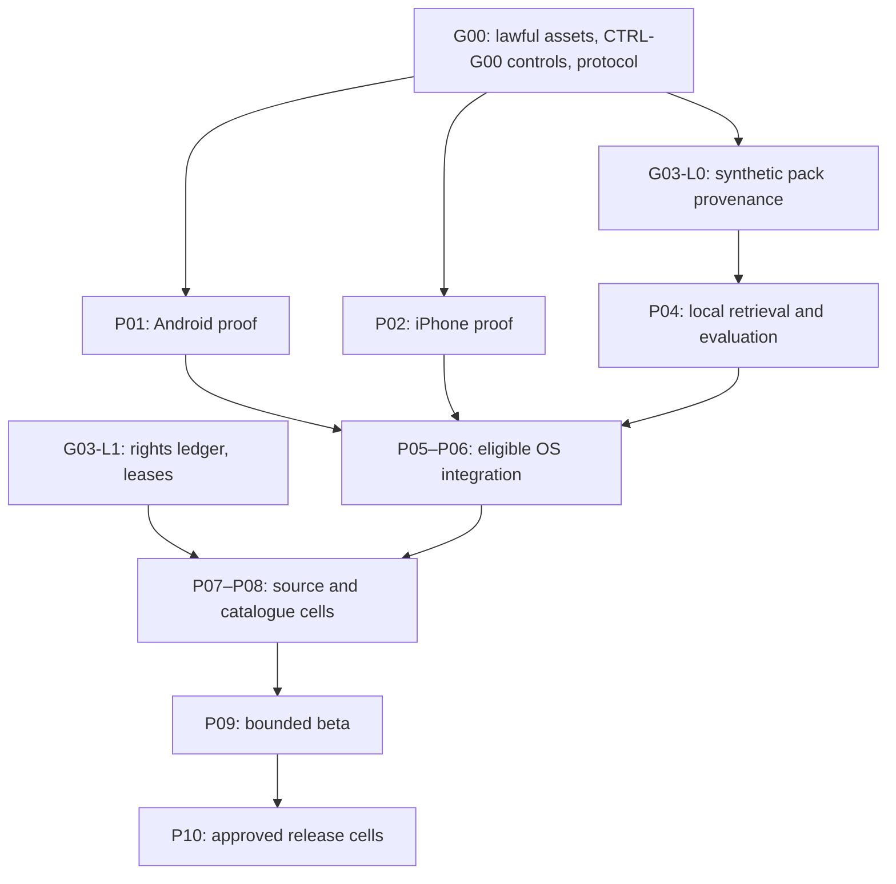

# CineDetect AI — Proposed Master Roadmap v4.2.1 (PROPOSED)

**Product:** CineDetect AI — user-initiated movie, television, drama and anime identification from video already playing in another app on the same phone.
**Version date:** 9 October 2026. **Supersedes (if approved):** Fable v4.2 PROPOSED; retains v4.1 as the inherited baseline.
**Status:** PROPOSED_REVIEW_REVISION · NOT IMPLEMENTED · NOT OWNER-APPROVED · DESIGN_UPDATED only.
**Provenance:** Fable 5.1 produced v4.2 from v4.1. Codex cross-reviewed both Fable attachments on 9 October 2026 and corrected the specification to v4.2.1. Original `[v4.2: F-nn]` tags identify the originating finding, not independent proof. The correction register in F12 records CQ-01–CQ-14 and material changes, including withdrawal of unsafe v4.2 recommendations. All 86 task IDs and 54 test IDs are preserved. No deferred feature is approved. Engineering remains **NOT_STARTED**; device, legal, rights and store outcomes remain **UNKNOWN / BLOCKED / UNVERIFIED**. Only document consistency and the explicitly identified arithmetic/source checks have been performed.

---

## F00. Authority, scope and invariants

The owner approves scope, spending and release commitments. Native leads supply platform evidence; rights counsel/licensors establish permitted operations; privacy/security reviewers assess data boundaries; independent ML QA signs evaluation; stores decide their own approvals. Roles are unassigned until P00 names people. No AI-generated document marks physical tests, contracts or store decisions PASS. This document authorises no implementation, purchase, publication or third-party contact.

The locked product remains native Android **and** iPhone research, with independently releasable capability cells only when explicitly approved (D03). First implementation is **L0** self-created/synthetic on-device recognition, followed conditionally by **L1** rights-approved bounded local catalogues. **Mode R (cloud screen processing) is OFF at build and runtime.** No captured screen-derived data — including title/candidate identifiers, scores, timing-linked lookup requests, hashes, OCR, audio, embeddings, crash-dump memory or telemetry fields derived from a scan — leaves the device in local mode. Incoming signed index updates are a separate declared data flow and must never be triggered by, or timed to, a scan event.

| Catalogue target | Required coverage detail |
|---|---|
| IND-HOL | Hollywood English-language films/TV/streaming; exact works, cuts and episodes |
| IND-IND | Indian Hindi, Tamil, Telugu, Malayalam and Punjabi; separate language scorecards |
| IND-PAK | Pakistani films, Urdu dramas and eligible series |
| IND-KOR | Korean films and dramas |
| IND-TUR | Turkish films and dramas |
| IND-ANI | Japanese anime films and episodes |

These are targets, not coverage claims. All are UNTESTED/RIGHTS_UNVERIFIED. Self-created diagnostic footage is not six-industry validation. Licensed subsets are permitted; never advertise unindexed titles or untested industry performance. `[v4.2: F-08; CQ-08]` F05 bounds a pack's reference hours; a small lawful subset from several industries might fit one pack. Multiple packs are an optional D10 design, not an inferred requirement or a promise of comprehensive coverage.

Source candidates: SRC-TIK TikTok public video, SRC-INS Instagram public Reels/video, SRC-FBK Facebook public video/Reels, SRC-YTB YouTube/Shorts, SRC-X public X video, SRC-SNP Snapchat Spotlight/public Stories. Every source×OS cell is UNKNOWN; **Snapchat is BLOCKED/OFF.** Private chats/Snaps, DMs, private-account screens, account/password/banking/payment views, notification banners, incoming-call screens, keyboards/autofill and protected media are excluded `[v4.2: F-17]`. No source affiliation or permission is implied.

Deferred (P11): URL pasting/download/scraping/resolvers; camera TV mode; gallery/screenshot/video upload; browser extensions; automatic acquisition of films; consumer subscriptions/advertising; B2B APIs; passive listening; actor face identification; guaranteed timestamps; universal recognition. No hidden working endpoints, unnecessary permissions or covert capture. No DRM/FLAG_SECURE bypass or Accessibility-service surveillance. No model training on user screens. Global distribution does not imply global recognition or rights.

## F01. Evidence, decisions and severity

Evidence statuses: NOT_STARTED, IN_PROGRESS, DESIGN_UPDATED, PASS, FAIL, BLOCKED, INCONCLUSIVE, DEFERRED, UNVERIFIED (document-level claim not confirmed against an installed SDK/device). All engineering tasks start NOT_STARTED; external-input tasks may be BLOCKED once the missing input is recorded. Each technical PASS requires an observed, reproducible result for a declared build/device/input. Documentary rights/store approvals need authentic external evidence. INCONCLUSIVE is never PASS.

Priority: **P0** permission/privacy/user-control/rights-critical; **P1** release-blocking feasibility/quality or critical-path contradictions; **P2** non-blocking improvements. No open P0 or relevant P1 at external beta/production.

| Owner decision | Unapproved proposal | Default until resolved |
|---|---|---|
| D01 — PROPOSAL_REQUIRES_OWNER_DECISION | Narrowly bounded local incidental private-frame processing only if strict acquisition isolation fails; independent privacy/legal review required. | Strict public-only consumer mode remains blocked if it cannot be enforced. Cloud/Snapchat OFF. |
| D02 — PROPOSAL_REQUIRES_OWNER_DECISION | Contract-specific offline leases, connectivity on expiry, fail-closed time recovery. | Only demonstrably compatible offline rights; no immediate-revocation promise. |
| D03 — PROPOSAL_REQUIRES_OWNER_DECISION | Release Android independently if iPhone fails and Android's own gates pass. | No unilateral platform-scope reduction (research on either OS may continue). |
| D04 — PROPOSAL_REQUIRES_OWNER_DECISION | Invite-only adult research in one approved country first. | No real-user beta without audience/region/entity decision. |
| D05 — PROPOSAL_REQUIRES_OWNER_DECISION | Approve numerical budgets, statistical rules (incl. clustered design, F05), retention and UX/value gates before outcomes. | Thresholds guide research only; no retrospective relaxation. |
| D06 — PROPOSAL_REQUIRES_OWNER_DECISION | Investigate camera/chosen-image/partner-content pivot after a core NO-GO. | All such features remain deferred. |
| **D07** `[v4.2: F-11; CQ-10]` — PROPOSAL_REQUIRES_OWNER_DECISION | Licensor-approved territorial assurance per pack: assess store-country plus attestation, a separate online activation/renewal workflow, or explicitly approved coarse location. Document each method's limits. | Restricted packs stay disabled until the exact method and lease terms are accepted; an online request alone proves no territory. No new permission or scan-triggered request. |
| **D08** `[v4.2: F-04; CQ-03]` — PROPOSAL_REQUIRES_OWNER_DECISION | Optional minimal committed RecognitionResult persistence: no image or query descriptor; device-bound encryption, backup exclusion and at most 15-minute validity. See F03 for expiry and cleanup. | Memory only; process death may lose a result. Do not add persistent scan counters or telemetry to measure that loss without separate approval. |
| **D09** `[v4.2: F-01; CQ-02]` — PROPOSAL_REQUIRES_OWNER_DECISION | After per-device inspection, decide consumer eligibility for any cell lacking a usable cross-app capture stop and post-capture Cancel path. A notification requirement would change the optional-permission contract and needs explicit approval. | Notification denial remains supported in lab research. Consumer cells without demonstrated controls remain BLOCKED; do not silently make notification permission mandatory. |
| **D10** `[v4.2: F-08; CQ-08]` — PROPOSAL_REQUIRES_OWNER_DECISION | Optional user-selected industry/language packs through a separate install/settings workflow; specify each pack and total installed/staging budgets. | Single synthetic L0 pack; total active installed index ≤250 MB (decimal), not 250 MB per pack. No catalogue promise. |
| **D11** `[v4.2: F-10; CQ-09]` — PROPOSAL_REQUIRES_OWNER_DECISION | Decide the proposed iPhone support range after per-path SDK/runtime/distribution evidence; the ScreenCaptureKit sample/symbol path under investigation lists iOS 27+. | Research compatible public API paths using available equipment. No blanket iOS 27 product minimum or permanent ReplayKit exclusion is approved. Missing equipment blocks only that path. |

## F02. Platform and privacy feasibility contract

**Android.** Research distinguishes app-window sharing on supported Android 14 builds (record QPR/build; S02) from API 37 source controls `PROJECTION_SOURCE_DISPLAY`, `PROJECTION_SOURCE_APP`, `PROJECTION_SOURCE_APP_CONTENT` and `MediaProjectionConfig.Builder` [S01–S04]. App-window capture excludes system UI but does not distinguish public and private views inside the app. `[CQ-09]` The official Builder reference documents `setSourceEnabled(int, boolean)` to expose or hide a source option; setting the initially selected source is a different operation. CAP-A03 must compile and test display-disabled/app-enabled configurations and attempt to escape them. Documentation is not device enforcement evidence. `APP_CONTENT` requires content-provider cooperation; do not assume third-party sources implement it. Android 15 QPR1+ documents a stop chip and lock-triggered projection stop [S01, V04]. Test exact devices; legacy user-choice UI is not asserted to prohibit full display.

**iPhone.** `[v4.2: F-10; CQ-09]` Pin installed Xcode/SDK, OS build, provisioning and every used symbol. The investigated ScreenCaptureKit sample lists iOS/Xcode 27; inspect each symbol's availability separately [S05–S11, V09–V10]. Its documented display/current-app paths do not establish arbitrary third-party-app isolation. Consumer scope remains blocked without a demonstrated boundary or approved D01. `screen-capture` background configuration motivates CAP-I05; no anecdote establishes reliability. ReplayKit broadcast symbols show bounded availability metadata [S13, V11–V12]: verify explicit deprecation, obsoletion and runtime attributes in installed headers. Deprecation, removal and store acceptance are separate questions; Apple 2.5.1 calls for phasing out deprecated technology, not an automatic rejection of every deprecated symbol [S16]. ReplayKit remains a conditional research candidate; no path is approved for release. D11 governs any support-range change. No audio keepalive.

**Post-capture execution.** `[v4.2: F-03; CQ-06]` Background survival must be measured during acquisition and after normal closure. A valid iOS background-task assertion must be requested early enough, may be denied, and must be ended on completion/expiry [V16]; `backgroundTimeRemaining` is diagnostic, not a promised grant. Android CAP-A04 uses the actual `MediaProjection.stop()` API and records foreground-service state. Do not invent a service type or keep capture active solely to keep the process alive. First attempt streaming local work while sampling, then bounded completion under F05. If it fails, report the tested path as failed/inconclusive and propose a separate design decision. D08 permits proposing only a committed result, never descriptor/frame persistence.

**Scope.** Strict public-only acceptance requires a credible technical boundary and legal/policy clearance; a heuristic, user declaration or lack of observed failures is insufficient. If the boundary cannot be provided, mark the affected consumer cell BLOCKED/FAIL, continue synthetic lab work only, or present D01/D06. No working screen API proves lawful commercial processing.

Record `LAB_CAPTURE_PASS`, `CONSUMER_SCOPE_PASS`, `SOURCE_POLICY_APPROVED`, `RIGHTS_APPROVED`, `STORE_APPROVED` independently. No aggregate PASS hides a failed dimension. Tests use dedicated accounts/devices and synthetic private screens; no real private pixels in evidence.

## F03. Onboarding, state machine and result contract

**First use:** explain limited catalogue and capture scope → separate readable Terms/Privacy (localised; governing language stated) → explicit Terms acceptance with version/hash/locale/time → relevant permission education → HOME/NOT SCANNING. Denying Terms prevents scanning while leaving legal information accessible. No screen, microphone, camera or gallery access at app open.

**Reopen:** load unchanged Terms receipt, inspect relevant permission state in context, remain idle. A material purpose/contract change (including a translation change of legal effect) triggers new notice/choice. Native recording approval is never replaced by Terms acceptance or a saved boolean. Optional permission denial affects only its feature; repeat prompting requires user action.

**Per scan:** local eligibility and valid pre-acquired entitlement check → Start → concise disclosure (capture Stop and post-capture Cancel paths) → native picker → bounded target wait → bounded acquisition with incremental local work → **close acquisition** → bounded local completion → local entitlement/evidence check → atomic result commit (memory only unless D08 approved) → release resources → result on return. No scan-triggered entitlement, update or metadata request. Capture need not stay active during matching. No prerecorded result may masquerade as analysis of uncaptured footage.

**Stop-path matrix** `[v4.2: F-01; CQ-02]` (candidate controls while another app is frontmost; inspect actual OS/OEM affordances before claiming exclusivity):

| Cell | Capture stop candidate | Post-capture / lifecycle requirement |
|---|---|---|
| Android 15 QPR1+ and later tested builds | System sharing chip; optional FGS notification action; in-app Stop | Chip may disappear when capture closes. Verify a separate Cancel path for unfinished matching; otherwise return-to-app Cancel must be usable and disclosed. |
| Older Android candidate, notifications permitted | FGS notification action, any observed OS sharing control, in-app Stop | Verify the actual notification/action and separate post-capture Cancel. |
| Older Android candidate, notifications denied | Inspect OS controls; Task Manager on Android 13+ is an app termination fallback [V07, Q02]; in-app Stop | Task Manager kills the whole app without a callback; it is not graceful cancellation. No invented sole-control claim. Consumer eligibility requires D09 and UX-02. |
| iPhone, ScreenCaptureKit candidate | System capture indicator/control plus in-app Stop; exact behavior UNVERIFIED | CAP-I02/UX-02 must verify capture Stop and post-capture Cancel separately. |
| iPhone, ReplayKit research candidate | Inspect system broadcast control and host/extension lifetime | Verify no orphan extension; deprecation/distribution tracked per path. |

Every candidate cell records capture stop, unfinished-computation Cancel, process-termination behavior and discoverability separately. A capture stop indicator cannot promise to cancel work after that indicator disappears. No control is marked operational by this table.

**Coordinator event table** `[v4.2: F-09; corrected CQ-02]`

| Event | Coordinator action | Result policy |
|---|---|---|
| New user start | Fresh unpredictable scan ID, generation and single lease; clear previous result and any approved persisted copy. | Never resume a previous acquisition. |
| Normal sample completion | Stop intake; record internal normal-close request; release capture resources using the measured API path; start post-capture timer. | Local computation may continue only while all cancellation, deadline and entitlement conditions remain valid. |
| Proven acknowledgment of app-requested normal closure | Handle idempotently using documented/measured adapter semantics. An EXPECTED flag alone does not establish callback cause. | Normal teardown alone does not invalidate permitted work. |
| In-app Cancel, observed user/system abort, lock, permission revoke, unsafe context, entitlement failure or deadline expiry before commit | Atomically invalidate generation; close intake; cancel workers and clear pending data, including after normal capture closure. | No uncommitted result may publish later. Lock does not silently become a normal completion. |
| Stop callback with unresolved cause, including stop/close race | Treat as cancellation when a user/system abort cannot be excluded by the supported API contract; record capability limitation. | Fail closed. If normal closure cannot be distinguished, this path cannot yet claim reliable post-close results. |
| Successful decision | Under the same coordinator lock/transaction, recheck generation, observed abort state, deadlines and local rights; commit one immutable minimal result. | At most one result. A cancellation serialized before commit always wins. |
| Process death or Task Manager termination | Assume no cleanup callback; no uncommitted job or lease is restored. | Memory-only result is lost. D08, if approved, may recover only an already committed, unexpired result under LIFE-04. |
| Return to app or explicit Discard | Recheck result validity and local entitlement; discard/expire invalid results; explicit Discard clears an approved stored copy too. | No stale result after expiry or known cancellation/revocation. |
| Concurrent/late callback | Reject mismatched scan/generation; no new acquisition. | No orphan or duplicate result. |

A local close flag, timing window or disclosure never converts a known user abort into consent to continue. Once acquisition has ended, record what the OS can and cannot report; unobservable cancellation is an unresolved capability risk, not a claimed guarantee. Resolve it before consumer admission. Test commit/abort linearization and ambiguous callbacks in LIFE-01/03 and SEC-02.

**Canonical result enum:** VERIFIED_MATCH, POSSIBLE_MATCH, NO_CONFIDENT_MATCH, OUTSIDE_CATALOGUE, INSUFFICIENT_SIGNAL, UNSUPPORTED_CAPTURE, PERMISSION_DENIED, CANCELLED, ERROR. REMOTE_UNAVAILABLE is reserved and unreachable in Mode L. `[v4.2: F-12]` **OUTSIDE_CATALOGUE is reserved and unreachable in L0/L1** (the pipeline has no identity source other than visual retrieval and no per-scan lookup); it may only become reachable through a separately approved on-device identity source. An ordinary non-match returns NO_CONFIDENT_MATCH. POSSIBLE_MATCH is visibly uncertain and can be suppressed for weak evidence. No numeric confidence without calibration; no episode/cut/time unless uniquely supported. Multi-title montage returns bounded segment-specific evidence or abstains.

Results appear in app; notifications stay optional pending an explicit D09 scope decision, with content-minimised text and no launch dependency. Initial result validity is until the next scan or 15 minutes, whichever occurs first. `[CQ-03]` D08 is unapproved: memory only by default; no history, frames, embeddings, descriptor checkpoints, durable scan counters or diagnostic snapshots. If approved, persist only the minimal committed result encrypted with device-bound protection and excluded from backup. Enforce expiry before every display/read using trustworthy time; reboot/clock rollback or uncertain elapsed time fails closed. Delete on the next scan, Discard, and the next available cleanup after expiry. Do not promise physical deletion at a wall-clock deadline while the process cannot run; document filesystem/flash limitations and residual encrypted bytes. No query-derived egress is authorized. Audio remains OFF.

## F04. Architecture, schemas and data boundaries

Native Kotlin/Swift capture adapter → one consent-aware coordinator → minimal quality/eligibility checks → bounded sampler → local hash/embedding candidate retrieval → temporal/equivalence verification → calibrated decision → local metadata result. Assess shared UI/React Native/Expo only after native capture feasibility. No backend framework is required for the initial spike.

Start with hash/flat lookup and a tiny permitted corpus. Model/runtime choice follows measured accuracy, operators, CPU/GPU/accelerator fallback, memory and licence evidence; Core ML/LiteRT/ONNX Runtime are candidates, not commitments. Keep execution local; no dynamic untrusted model code. Pack updater is separate from the capture/recognition worker and is never scheduled relative to a scan. No per-scan metadata lookup in L0/L1. Optional future backend remains out of scope.

Canonical records, versioned and locally minimised:

| Record | Required fields |
|---|---|
| TermsReceipt | terms_version/hash, **locale, rendered_text_hash, governing_language_version** `[v4.2: F-14]`, accepted_at, disclosure_version; separate purpose-choice records; no OS permission token |
| ScanSession | scan_id, cancellation_generation, coordinator_state, capture_closed_reason, monotonic_deadlines (permission, switch, sampling, total, **post_capture_budget**), candidate capability ID, rights snapshot ID, timestamps, terminal reason; never store reusable projection handles |
| CapabilityCell | source/build/OS/patch/device/region/picker mode; source_identity_method/confidence; API path; scope guarantee and limits; **stop_path** `[v4.2: F-01]`; lab/consumer/policy/store statuses; test/retest/expiry, reviewer, build and evidence hashes |
| ReferenceAsset/RightsGrant | work/series/episode/edition/segment IDs; licensor and chain-of-title evidence; source/hash; permitted acts/territories; query/reference distinction; dates; derivative/local distribution/training/display rights; revocation/offline conditions; approval status |
| PackManifest/EntitlementLease | pack/version/hash/size; model/preprocessing/index/calibration compatibility; rights epoch; valid-from/until; signed-time basis; key ID; tombstones; minimum allowed version; region/operation grants; **region_assurance_method** (D07); **indexed_hours, title_count, descriptor_bytes, sampling_interval** `[v4.2: F-08]` |
| RecognitionResult | scan/generation, state, candidate work/edition/episode, minimal segment/reference evidence, ambiguity flags, versions, local entitlement recheck, created_at, expires_at, trustworthy validity-clock basis; persistence_mode (D08); no captured image or query descriptor |
| GateEvidence | task/test/gate, run ID, build/source hash, physical device/OS/source build, lawful asset manifest, setup, expected and observed result, limitations, artifact hash, author, independent reviewer |

Asset permission is checked at ingest, pack distribution, query acceptance, decision and rendering. Unknown operation/territory denies the affected asset. `[CQ-10]` Online activation alone is not territorial proof: require licensor acceptance of the exact D07 method. A separate, disclosed pack-settings workflow may obtain a lease before scans; the scan path uses local validity checks and fails closed if a usable lease is absent. No automatic or query-timed renewal. If contract requirements cannot be enforced by that design, exclude the pack.

Signed distributable updates bind the complete model/preprocessing/index/calibration/rights tuple. Development L0 packs instead use an integrity manifest explicitly marked UNCALIBRATED until P04-T05; it cannot pass a release gate. Stage and validate before atomic activation; test network loss, disk full, interruption, backups, key rotation and rollback. Compatibility rollback cannot lower revocation epochs. Pack parsing is untrusted. `[CQ-12]` No third-party crash/analytics SDK in L0/L1. Disable app-controlled memory-dump/logging features; document OS-owned diagnostics outside app control and inspect synthetic canaries. Do not claim that app configuration disables every OS report or forensic copy. Any observed prohibited query-data exposure blocks the affected consumer build.

For offline rights, contract validity bounds availability. A signed finite lease plus trustworthy elapsed time is the candidate design; on loss of trustworthy time/reboot/reset, affected rights may require online validation. A disconnected phone cannot learn new revocations instantly; no agreement may be represented as satisfying a stricter promise than the client can enforce. Self-created/permissive packs remain available under their own grants.

## F05. Proposed nonfunctional and evaluation budgets (D05 proposals)

These are proposals, not observed limits. Tighten where a device/framework needs it. If unattainable, report the result and request a decision; never change a denominator silently.

| Area | Proposed experiment limit / rule |
|---|---|
| Native permission waiting | No frame capture before grant; proposal: abandon the app's pending request after 60 s, invalidate late callbacks, and do not claim to dismiss OS UI. This is a chosen research timeout, not a verified universal picker limit. |
| Capture and sampling | ≤45 s acquisition from native grant (includes target wait ≤30 s and sampling ≤12 s); acceptance uses an 8 s stable-scene window. Proposed stable-scene-to-decision p90 ≤15 s; record all-start time and failures separately. Post-close hard limit does not relax this latency target. |
| Intake/buffers `[v4.2: F-06; CQ-05]` | OS delivery rate is not assumed controllable. Inspect metadata/drop and release surplus buffers promptly; select/process at most one frame per 500 ms (≤2 fps, monotonic timestamps), downsample to 640×360-equivalent. At most 3 app-owned decoded frames including in-flight work: 2,764,800 B ≈2.76 MB RGBA. OS buffers, surfaces, copies and model memory counted separately. |
| **Post-capture execution** `[v4.2: F-03; CQ-06]` | Hard completion limit ≤8 s after capture closes, subject to actual remaining background time and earlier cancellation/expiry. Also meet stable-scene-to-decision p90 ≤15 s: an 8 s sampling window leaves at most 7 s for closure, residual computation and commit on that target, not 8+8=15. Request iOS assertion early; log denial/expiry and Android FGS state. No capture extension or descriptor persistence is approved. |
| Stop | On observed cancellation, reject new intake/publication immediately; measured physical action→no-use p95 ≤250 ms, max ≤1 s, with callback→teardown ≤1 s reported separately. OS delivery delay belongs in the user-facing action measurement. If unmeasurable, INCONCLUSIVE; Task Manager has no callback, so use an external observation. |
| Memory/pack | Pilot incremental working set ≤200 MB, model ≤100 MB, total active installed index ≤250 MB (decimal). Lower measured platform/extension limit overrides. Measure 50/100/250 MB payloads plus metadata, indexes, caches, mapped resident pages, download/update staging, backups and peak disk usage; preregister staging/free-space cap. Do not multiply the installed cap by pack count. |
| Startup and thermal | p90 local engine ready ≤3 s on declared tier; no thermal-critical state, crash or sustained memory growth across repeated scans; abort/reduce on thermal pressure. |
| Energy `[v4.2: F-18; CQ-12]` | Matched playback-only and playback+scan runs, ≥20 per condition; incremental energy ≤0.2% of declared rated_energy_Wh per completed scan (19.25 Wh →138.6 J); also report failures and all-start cost. Use supported quantitative counters with units/resolution, an appropriately validated integrated system-power trace, or calibrated external measurement. Handle unsupported Android counters and charging/debugger effects. Qualitative Xcode impact gauges or status-bar percentages cannot alone prove the Joule threshold. State uncertainty; unresolved measurement → INCONCLUSIVE [Q04–Q05]. |
| Precision | Lower preregistered 95 % bound ≥95 % among verified accepted decisions; wrong edition/episode counted per promised granularity. Under independence with n = 500 this allows ≤15 errors. |
| Recall/top-1 | Lower 95 % bound ≥85 % clean (≥873/1,000 under independence) and ≥70 % edited (≥729/1,000), abstentions counted as failures. Report candidate-retrieval recall separately. |
| Unknown | Upper 95 % bound ≤2 % false verified on absent works (≤11/1,000 under independence); also test precision under plausible prevalence. A 2 % test rate alone does not approve broad deployment. |
| Pilot counts `[v4.2: F-07; CQ-07]` | Proposed release evaluation: clean ≥1,000 queries over ≥200 known works; edited a separate ≥1,000 over ≥200 known works; absent ≥1,000 over ≥300 absent works; ≥500 accepted decisions with separately reported composition. More than one query per work requires clustered analysis; common works across clean/edited do not make the sets independent. Preregister interval method, sampling/cluster structure, ICC sensitivity/power plan and adequacy criteria. L0 dry runs are exploratory and cannot satisfy this release gate. |
| User value | ≥30 % verified-correct useful results across all started scans in the deliberately eligible beta cohort and ≥95 % accepted precision there; report coverage, delivery failures (D08) and confidence intervals. A product hypothesis, not a market standard. |
| UX | At least 7/8 invited adult participants complete without help and all find a stop path (95 % interval ≈53–98 %: exploratory only). Report taps/abandonment. |

**Index capacity (payload-only upper bounds, ESTIMATE; CQ-08)** `[v4.2: F-08]`. 1,000 × 120-minute film-equivalents sampled every 2 s = 3.6 M vectors; at 512 B descriptor + 16 B locator = 528 B → 1.9008 GB (1.77 GiB) before model/overhead.

| Bytes/vector | Vectors in 250 MB | Hours @2 s | ≈2-h films | ≈45-min episodes | Hours @5 s |
|---:|---:|---:|---:|---:|---:|
| 528 | 473 k | 263 | ~132 | ~351 | 658 |
| 144 (128 B + 16 B) | 1.74 M | 965 | ~482 | ~1,286 | 2,411 |
| 48 (32 B PQ + 16 B) | 5.21 M | 2,894 | ~1,447 | ~3,858 | 7,234 |

250 MB = 250,000,000 bytes; vectors = floor(bytes / bytes-per-vector), hours = vectors × sampling interval / 3,600. The 528 B row gives 263.05 h, about 132 two-hour film-equivalents or 351 45-minute episodes, before overhead. Title counts depend on actual durations and reference sampling; not every film/episode is fully represented by this estimate. Index structures, metadata, alignment and other overhead reduce usable capacity. Compression/density changes require accuracy measurement (P04-T02).

**Evaluation protocol.** `[CQ-07]` Independent numeric examples above use two-sided 95% Wilson score intervals with z=1.959963984540054; they are not clustered pass cutoffs. With equal-size clusters, 1+(m−1)ρ is only a planning design-effect approximation; reduced effective n does not halve allowable raw errors. Preregister a defensible cluster method and small/zero-event treatment (a naive all-zero cluster bootstrap cannot establish a rare-event upper bound), plus subgroup adequacy and multiplicity where claiming simultaneous coverage. Independently label work/edition/episode/segment; freeze development, calibration and final families; isolate transforms, series and recaps. Lawful known-scene references may remain in the gallery but final queries/labels cannot tune it. Entire unknown works/linked editions stay absent. Record denominators, cluster IDs, intervals, failures, abstentions and latency/resource distributions. Challenge clean/edited/dubbed/mirrored/cropped/letterboxed/rotated/compressed/captioned clips, shared intros/music/actors, remakes, trailers, games, AI scenes and montages. Passing aggregate metrics alone never certifies a sparse industry/language.

## F06. Dependencies, critical path, controls and effort

Laboratory gates are distinct from consumer gates. `[CQ-04]` Every gate record declares track, build, assets and purpose. G00 for desktop L0 needs lawful assets, protocol, owners and applicable desktop controls; it does not require either phone. G00 for a mobile branch needs that branch's equipment and DATA-L00 Part A, then authorizes its first supervised Part B capture. `G-NATIVE(os)` = the relevant OS's G01 or G02 lab proof, never both; lab proof may use bounded dummy compute, while real-model device budgets are tested in P04-T08. `G-RELEASE(os,source,territory,pack)` requires all applicable final privacy, scope, policy, rights, quality and store evidence.

Edges from B/C to E mean **either passing OS branch**. Desktop/local P04-T01…T07 starts after the desktop-scoped G00 and G03-L0; D02 and phone inventory do not block it. G03-L0 still requires contributor/asset operation rights; it defers contract-specific L1 leases, not permission. G04 records purpose **LAB** for exploratory synthetic results and **RELEASE** for the exact frozen deployment tuple. A LAB record may support synthetic integration but cannot admit a beta, advertise coverage or inherit release thresholds. P04-T08 performs real-model device validation after the relevant native lab proof. An early source canary additionally needs lawful synthetic assets and source-policy clearance.

**CTRL-G00 — staged admission controls** `[v4.2: F-02; CQ-01]`

1. Before any capture, inspect the minimal lab build: no analytics/crash/logging SDK, no app networking or frame-file output, no unexpected permissions. Android lab manifest omits INTERNET, including merged dependencies. iOS has no equivalent manifest internet-denial switch; ATS secures applicable connections and is **not** an egress firewall [Q01].
2. For the first mobile trial, preload synthetic fixtures and enforce device/test-network isolation independently of app settings. Disable cellular and alternate interfaces; use a controlled local network with blocked external egress and independently verified capture/deny rules, or a documented equivalent air-gapped arrangement. Validate isolation with a synthetic network canary that contains no screen data. Verify IPv4/IPv6 and reconnect paths as applicable.
3. Dedicated non-personal devices/accounts only. No real private content; use P00-T07 rights-approved fictional scenes. Inspect source/build/file-write paths and hold a non-capture coordinator Stop/timeout rehearsal. Identify the OS termination fallback in advance; its live behavior is tested in Part B.
4. DATA-L00 **Part A** is this no-frame preflight and signed witness record. G00 may admit the first tightly bounded, witnessed synthetic capture after Part A passes. No full scan is required before permission to conduct that first scan.
5. DATA-L00 **Part B** is that first supervised capture/stop test plus file/network inspection. If it fails or is inconclusive, stop the branch and remediate before further capture. Full DATA-L01/02/03 online/offline and release-build testing remains later; an isolated zero-packet test alone cannot prove production egress safety.
6. Evidence uses synthetic asset IDs, aggregate timing/counts and build/asset hashes. Do not log hashes or descriptors of real user queries. Keep protected local evidence, witness, run/build IDs and retention dates; no captured frames in app storage.

**Research termination criteria** `[v4.2: F-19]`

| Condition | Consequence | Decides |
|---|---|---|
| Day-10 checkpoint shows no useful frames on two Android configurations | Android lab INCONCLUSIVE; bounded extension for a named cause or stop | Owner on native lead advice |
| CAP-I05/CAP-I01: joint stream-and-post-close success on the tested configuration | 9–10/10 is an exploratory lab criterion only; 8/10 → INCONCLUSIVE with named cause; 0–7/10 → FAIL for that path. Unsupported background API/configuration fails regardless of counts. Any stop/privacy violation overrides success. Investigate another lawful API path or propose a change; do not approve it automatically. | Owner + iOS/QA |
| CAP-A03/CAP-04: no mode restricts acquisition to the chosen app on any tested API and D01 declined | Android consumer cell BLOCKED; L0 lab research only | Owner + Privacy |
| AI-01 synthetic clean top-1 < 60 % after P04-T02 baselines | Architecture review before any device integration | ML lead |
| G04 INCONCLUSIVE twice for the same cause | Stop or re-scope catalogue/density (D10) | Owner |
| No rights grant obtainable for any target within the owner's cash/time cap (P03-T07) | L1 BLOCKED; L0 continues or stop | Owner + Rights |
| PRIV-01 counsel blocker | No external beta; research may continue | Owner |
| Immediate stops (F09) | Quarantine; investigation | Security/Privacy |

Effort estimates below are engineering judgment in **person-days**, assuming experienced contributors and available lawful material/equipment. They are not bids or calendar promises; research termination is a valid outcome.

| Phase | Indicative effort | Uncertainty |
|---|---:|---|
| P00 | 5–9 (+1 for CTRL-G00/termination table) | External policies, owner decisions, equipment may block. |
| P01 | 5–9 (+CAP-A04, UX-02) | Device/vendor differences; enforceable capture scope. |
| P02 | 6–12 (+CAP-I05) | SDK access, background behaviour, deprecated extension, distribution suitability. |
| P03 | 5–10 engineering; licensing undated | Negotiations have no defensible estimate. |
| P04 | 10–20 | Corpus, operators, statistics, coverage. |
| P05 | 7–13 per initially supported OS/UX mix | Real picker behaviour, Stop matrix, persistence (D08). |
| P06 | 6–12 plus independent reviewer | Findings may reopen native/data design. |
| P07 | 5–10 initially | Not six simple tests. |
| P08 | 5–15 per bounded expansion | Acquisition/labeling/licence lead times unknown. |
| P09 | 5–10 plus 2–4 weeks observation | Recruitment, incidents, low usefulness may stop beta. |
| P10 | 3–6 | Store/legal decisions external. |
| P11 | Not estimated | Deferred. |

Do not add these into a launch date. Critical path: **capture-boundary feasibility + post-capture execution + appropriate rights → useful local retrieval on target device → defensible consumer scope → real-source compatibility → measured beta value → external approvals.** Android evidence cannot grant iPhone approval and vice versa.

## F07. Work breakdown: 86 preserved task IDs with concrete subtasks

Subtask IDs append `a/b/c` to the task ID. Named phase lead owns every row unless stated. Evidence authors and independent reviewers are identified in the gate register. All tests are **planned, not run**. When a task has an early development check and a later final-tuple check, the gate records the completed subtask and exact evidence scope; the whole task is not marked complete early. A preflight/build task may run without frames before G00; only the explicit G00-admitted subtask may acquire frames.

#### P00 — Research inventory and experiment admission

Owner: Product + relevant Native Lead or desktop ML Lead + Rights/Privacy reviewer. Entrance: review-only assignment. Exit **G00**, scoped per track: actual equipment for that track, lawful diagnostic assets, preregistered protocol and applicable CTRL-G00/DATA-L00 Part A. Part B is the first authorized mobile capture, not a circular entrance requirement.

| Task | Concrete subtasks | Dependency | Acceptance / evidence |
|---|---|---|---|
| P00-T01 | a. Inventory repo/access without modification; b. record desktop equipment separately from actual Android configurations and iPhone/SDK-path candidates; c. list absent devices, SDKs and provisioning explicitly. | None | ENVIRONMENT scoped per track; no guessed hardware/SDK or requirement for both OSs to start desktop L0. |
| P00-T02 | a. Check all used SDK symbols/availability/deprecation **from installed headers** (API 37 `MediaProjectionConfig.Builder`; iOS 27 ScreenCaptureKit; ReplayKit deprecation); b. compile planned path when authorised; c. distinguish documented, installed, measured. | P00-T01 | SDK_MATRIX; CAP-I03/CAP-A03 planned; UNKNOWN/UNVERIFIED retained. |
| P00-T03 | a. Obtain current regional terms for six sources (**X re-retrieved on/after 9 Oct 2026**); b. retain effective dates and intended act; c. escalate inaccessible/unclear text. | None | SOURCE_POLICY matrix; missing text blocks that source trial. |
| P00-T04 | a. Name entity, country, audience, owners and independent reviewers; b. decide or explicitly defer D01–D11; c. record approved time/cash caps. | Owner | DECISIONS with approver/date; PRIV-01 started; no unresolved beta jurisdiction. |
| P00-T05 | a. Separate transient-query and corpus acts; b. ask counsel about local derivatives/territories/offline removal and **D07 options**; c. request nonbinding acquisition information only. | None | RIGHTS_STRATEGY; no purchase/permission assertion. |
| P00-T06 | a. Map acquisition/processing/storage/egress incl. crash paths; b. define synthetic-only harness, cancellation and **CTRL-G00**; c. complete DPIA screening. | None | THREAT_MODEL, CTRL-G00 checklist, DPIA_SCREENING before first capture. |
| P00-T07 | a. Create owner-authorised diagnostic motion clips (≥20 synthetic "works" × ≥3 "editions"); b. create unmarked natural scenes, unrelated negatives and **synthetic private screens/overlays** separately; c. manifest contributor/asset rights and hashes. | None | Rights reviewer approves exact assets; no industry-quality claim. |
| P00-T08 | a. Freeze split families and separate clean/edited/unknown denominators; b. preregister interval method, cluster design, ICC sensitivity, power/adequacy and rare-event handling; c. distinguish L0 exploratory protocol from D05 release proposals before outcomes. | P00-T07 | EVAL_PROTOCOL and independent AI-06 setup review; no effective-n shortcut to a confidence interval. |
| P00-T09 | a. Maintain 86 tasks, 54 tests, 13 concrete gate rows (G03 split), 11 decisions; b. resolve aliases/ranges and dependencies; c. assign retention/access/reviewer and record deferred applicability. | None | TRACE-01; no undefined references or private query evidence. |

#### P01 — Android native laboratory proof

Owner: Android Engineer; independent witness: Native QA/Security. Non-capture build/preflight preparation may follow applicable P00 inventory/control work; **actual frame capture requires G00 and DATA-L00 Part A**. Exit **G01** with separate lab-capture and consumer-scope decisions. Full-screen synthetic tests are diagnostics, never consumer permission proof.

| Task | Concrete subtasks | Dependency | Acceptance / evidence |
|---|---|---|---|
| P01-T01 | a. Prepare minimal visual-only lab build without INTERNET, capture disabled; b. correct mediaProjection FGS configuration; c. run DATA-L00 Part A before submitting G00. | P00-T01 + P00-T06 + P00-T07; no frames authorized by this task | Build/manifest identity and signed Part A; G00 then admits Part B in P01-T02. No build-before-build prerequisite. |
| P01-T02 | a. First supervised DATA-L00 Part B after G00; b. native picker/deny/cancel; c. continue diagnostic sessions only after Part B passes. | P01-T01 + G00 for Android | DATA-L00 Part B, CAP-A01, CONS-05; no automatic start. |
| P01-T03 | a. Two separate sessions; b. token/intent reuse rejection in harness; c. late permission return. | P01-T02 | CONS-04, LIFE-02; fresh native request per session. |
| P01-T04 | a. Audit API 37 `DISPLAY` vs `APP` sources and whether the requester can restrict to `APP` (**`APP_CONTENT` out of scope for third-party sources** `[v4.2: F-13]`) vs legacy choice; b. attempt display selection and other-app transitions; c. same-app seeded private-view transition. | P01-T02 | CAP-A03, CAP-04; scope PASS/BLOCKED separately; no heuristic certification. |
| P01-T05 | a. Bounded target wait and timestamped frame selection; b. incremental local dummy workload; c. normal close and measured legal background completion/FGS lifecycle. | P01-T02 | CAP-06/07, OPS-02, CAP-A04; real model/pack budgets deferred to P04-T08. |
| P01-T06 | a. Deny/stop/lock (Android 15 QPR1+ auto-stop)/rotate/resize/force-stop/process-kill; b. contention with another projection; c. lifecycle races incl. **lock-after-close and chip-stop race** `[v4.2: F-09]`. | P01-T02 | CAP-A02, LIFE-01/02/03, SEC-02; no ghost scan/restart. |
| P01-T07 | a. Inspect controlled packets, endpoints, app files and available tombstones/crash logs; b. synthetic crash/reconnect canaries; c. audit query-derived fields. | P01-T02; DATA-L00 Part B | DATA-L01/02/03 lab scope; no raw/query-feature persistence; D08 remains off unless approved. State OS-owned diagnostic limits. |
| P01-T08 | a. Repeat on two actual configurations; b. independent witness; c. sign lab and consumer capability cells with limits/expiry and **stop_path (UX-02)**. | P01-T03–P01-T07 | G01 dossier; unsupported cells OFF; D09 cells BLOCKED. |

#### P02 — iPhone native laboratory proof

Owner: iOS Engineer; independent witness: Native QA. Non-capture SDK/build preparation precedes G00; actual capture requires the tested path's G00 and Part A, compatible real device/SDK/provisioning. The ScreenCaptureKit candidate needs its documented iOS/Xcode 27 setup; missing that setup does not settle other paths. Exit **G02** records lab, scope and distribution feasibility separately.

| Task | Concrete subtasks | Dependency | Acceptance / evidence |
|---|---|---|---|
| P02-T01 | a. Pin SDK/header/channel attributes per symbol without capture; b. inspect the iOS 27 sample and ReplayKit candidate; c. separate availability/deprecation/runtime/distribution questions. | P00-T01 + P00-T02 + P00-T06 | CAP-I03 documentary/compile scope; runtime checks remain later. No product minimum or permanent API exclusion inferred [CQ-09]. |
| P02-T02 | a. Prepare minimal visual-only picker/stream with capture disabled; b. justified background configuration and early balanced finite task request; c. exclude camera/mic/Photos/file output and run DATA-L00 Part A. | P02-T01 + P00-T07 | Build identity and signed Part A for G00; this preparation authorizes no frames. |
| P02-T03 | a. Run first supervised DATA-L00 Part B after G00, then CAP-I05/CAP-I01; b. synthetic clip in a separate foreground app; c. joint stream/decision measurement. | P02-T02 + G00 for iOS | Part B before further sessions; real-device evidence; UNKNOWN if equipment absent; no debugger-assisted survival. |
| P02-T04 | a. Stop/lock/notification/foreground-switch/host-kill; b. extension IPC/termination if applicable; c. scoped and private-transition tests incl. overlays. | P02-T03 | CAP-I02/I04, CAP-04, LIFE-03; sample-handler info not assumed continuous identity. |
| P02-T05 | a. Audit network/files/app-group/snapshots/crash logs; b. measure memory/thermal/extension limit; c. confirm no audio keepalive. | P02-T03 | DATA-L01/02/03, OPS-01; limitations recorded. |
| P02-T06 | a. Review physical findings and production-config archive; b. separate compilation/upload from store approval; c. record each measured support range or NO-GO/proposal. | P02-T01–P02-T05 | G02, REL-02; D03/D06/D11 remain required for material scope decisions. |

#### P03 — Lawful references and offline package governance

Owner: Data Engineer + Rights Lead; Security reviews distribution. Entrance authorised assets and G00. Exit **G03-L0** (provenance/integrity for synthetic packs) and **G03-L1** (rights ledger, leases, revocation for licensed packs) `[v4.2: F-05]`.

| Task | Concrete subtasks | Dependency | Acceptance / evidence |
|---|---|---|---|
| P03-T01 | a. Define work/series/episode/cut/alias/segment IDs; b. shared-scene equivalence groups; c. version schemas/migrations. | G00 | Referential integrity; edition/alias fixtures. **G03-L0 item.** |
| P03-T02 | a. Default-deny operation/territory ledger; b. distinguish reference, query, metadata and derivative permissions; c. authentic licence/issuer evidence. | P03-T01 | RIGHTS-01/03 for licensed packs. L0 still needs a simpler contributor/asset grant manifest covering every intended act. |
| P03-T03 | a. Reproducible index from authorised assets only; b. pin sampling/model versions; c. measure bytes per reference hour; manifest declares indexed_hours/title_count. | P03-T01 (L0) / P03-T02 (L1) | Builder manifest/hash; IDX-01 baseline. **G03-L0 item.** |
| P03-T04 | a. Validate provenance/parser bounds; b. corruption/duplicate checks; c. sign the development integrity manifest with explicit model/preprocessing/index versions and UNCALIBRATED status. Bind final calibration only after P04-T05. | P03-T03 | G03-L0: basic SEC-01 tamper rejection, no final calibration prerequisite. Full SEC-03 mixed/stale/revoked tuple testing before distributing final packs. |
| P03-T05 | a. Enforce ingest/query/decision/display rights; b. expiry/tombstones/offline validity per approved D02; c. accepted D07 region assurance. | P03-T02 + P03-T03 for L1; approved applicable decisions | RIGHTS-01/02/03/04; no L0 route around licensed rights, and no instant offline revocation claim. |
| P03-T06 | a. Stage/activate signed rights/index development fixtures atomically; b. protect revocation epoch through rollback/disk-full/reboot/restore; c. repeat with the final calibrated tuple after P04-T05 before distribution. | P03-T05 for pre-evaluation rights controls; P04-T05 additionally for final tuple | G03-L1 uses rights/supply-chain fixtures and applicable IDX-01/SEC-03/RIGHTS-04 checks; final calibrated-pack checks are required later before release, not before calibration research. |
| P03-T07 | a. Acquisition matrix for six industries/languages **with per-pack hour budgets (D10)**; b. request distribution/offline-use terms **stating the D07 assurance method**; c. record costs/lead times as quotes or UNKNOWN. | P03-T02 | Rights gaps and owner spending decisions; no purchase. |

#### P04 — Local recognition and independent evaluation

Owner: ML Engineer; independent evaluator owns final labels/report. Entrance: G03-L0 for synthetic development; G03-L1 additionally before any licensed asset use; relevant G-NATIVE(os) for device capture/performance. Exit **G04** records LAB or RELEASE purpose, exact dataset/model/pack/device and applicable criteria. A 20-work synthetic pilot cannot pass a 200-work release gate.

| Task | Concrete subtasks | Dependency | Acceptance / evidence |
|---|---|---|---|
| P04-T01 | a. Blank/static/UI/quality checks on lawful fixtures; b. bounded normalization; c. integrate native frames only after that OS lab gate. | G03-L0; G-NATIVE(os) for device integration | CAP-03, OPS-02; filtering never certifies privacy. |
| P04-T02 | a. Benchmark hash and flat baselines; b. compare compact embeddings/compression (528/144/48 B); c. 2 s/5 s/shot sampling. | P04-T01 | AI-01, IDX-01; speed/recall/size report against the F05 capacity table. |
| P04-T03 | a. Verify ordered reference intervals; b. segment montages; c. speed edits, recaps, shared footage. | P04-T02 | AI-03/04/05; no music/actor-only proof. |
| P04-T04 | a. Resolve multilingual names; b. work→edition→episode→time evidence hierarchy; c. suppress unsupported stills/detail. | P04-T03 | AI-05, RIGHTS-03. |
| P04-T05 | a. Freeze calibrated thresholds; b. one result enum and ambiguity policy (OUTSIDE_CATALOGUE unreachable); c. bind model/index/calibration. | P04-T03 | AI-02/07; never derive absence from non-match. |
| P04-T06 | a. All edited/dubbed/mirrored/unknown cases; b. query-gallery leakage audit; c. preserve blind labels and failures. | P04-T05 | AI-01–AI-07; full confusion/abstention report. |
| P04-T07 | a. Independent evaluation against the frozen applicable protocol; b. cluster-aware bounds and subgroup adequacy; c. coverage/prevalence stress. | P04-T06 | AI-06/08; synthetic LAB findings explicitly exploratory; RELEASE requires F05 counts/bounds and exact rights-approved tuple, or INCONCLUSIVE/FAIL. |
| P04-T08 | a. Cold/warm CPU/GPU/fallback on each device **including backgrounded post-capture compute**; b. energy/thermal/memory/update space; c. constrain catalogue if needed. | P04-T06; G-NATIVE(os) | OPS-01/02, IDX-01; G04 per device/pack. |

#### P05 — Accessible consent and integrated mobile UX

Owner: Product/UX + Native Engineers. Entrance G00 for designs; corresponding native proof and G04 for integrated recognition. Exit **G05**: declared limited journey verified (not consumer privacy clearance).

| Task | Concrete subtasks | Dependency | Acceptance / evidence |
|---|---|---|---|
| P05-T01 | a. Draft separate Terms/Privacy/scan explanation per locale with governing language; b. explain limited catalogue, scope risks and the cell's Stop path; c. human/legal review of actual data flows. | G00 | CONS-01, PRIV-01; no placeholder production policy. |
| P05-T02 | a. Store versioned Terms receipt incl. locale/rendered hash; b. separate purpose choices; c. changed Terms (incl. translation-only) without silent widening. | P05-T01 | CONS-02/03 `[v4.2: F-14]`. |
| P05-T03 | a. Native picker from user action only; b. no fake persistent permission; c. deny unsupported device/source/pack/stop-path cell before scanning. | G-NATIVE(os), P05-T01 | CONS-04/05, CAP-07. |
| P05-T04 | a. Canonical states, timings and post-capture budget; b. honest ambiguity/capture failure text; c. result retention and **persistence per D08 (LIFE-04)**. | P05-T03, G04 | AI-07, LIFE-03, LIFE-04, UX-01 `[v4.2: F-04]`. |
| P05-T05 | a. Accessible in-app Stop and **per-OS-version out-of-app Stop (matrix, UX-02)**; b. notification-free return; c. natural completion vs cancellation distinction incl. Discard. | P05-T04 | LIFE-01/02/03, UX-01, UX-02 `[v4.2: F-01]`. |
| P05-T06 | a. Revoked/denied access and repeated opening; b. optional audio/notification refusal; c. changed Terms and late callbacks. | P05-T05 | CONS-01–CONS-06, AUD-01. |
| P05-T07 | a. Screen readers/font scaling/contrast/reduced motion; b. review each explicitly shipped UI/legal locale (catalogue languages do not mandate UI languages); c. invited-user study only with D04 and applicable PRIV-01 approval. | P05-T04; research approvals before invitations | UX-01: retain proposed 7/8 independent completion and all locate Stop, with exploratory limitation. |

#### P06 — Security, privacy and update assurance

Owner: Security/Privacy Lead; independent reviewer for exit. CTRL-G00 precedes capture. Exit **G06**: zero open P0 and applicable P1, no query-data egress, documented residual risk.

| Task | Concrete subtasks | Dependency | Acceptance / evidence |
|---|---|---|---|
| P06-T01 | a. Update threat model for actual API path; b. challenge source/private-boundary evidence; c. enumerate SDK/update/backup/crash-dump risks. | G-NATIVE(os), P00-T06 | Privacy boundary decision and threat evidence. |
| P06-T02 | a. Single lease and cancellation generation; b. race normal close vs abort vs chip-stop; c. reject stale results. | P05-T04 | LIFE-01/02/03, SEC-02. |
| P06-T03 | a. Remove query-bearing logs, third-party crash SDKs and backups; b. disable app-controlled memory dumps; c. inspect synthetic crash/reconnect canaries and identify OS-owned diagnostic limits. | P05-T04 | DATA-L01/02/03; no claim to disable every system report; prohibited exposure blocks the build. |
| P06-T04 | a. Soak stop/deny/revoke/lock/crash and buffer pressure; b. measure teardown; c. verify no automatic recovery capture. | P05-T05 | CAP-A02/CAP-I02, OPS-02. |
| P06-T05 | a. Pin dependency/model rights and SBOM; b. verify bounded signed parsers and final compatible tuple; c. test key/rollback handling for enabled distribution paths. | L0: P03-T04 + P04-T08; L1: also P03-T06 | SEC-01/03, IDX-01 with declared lab/release scope; L0 development does not require licensed leases. |
| P06-T06 | a. Scope/capability expiry; b. applicable pack-rights controls including region; c. offline expiry and unknown-time behavior. | P05-T03; L0 P03-T04; L1 also P03-T06 | CAP-07 and applicable RIGHTS-04; no consumer release without exact grants; no remote cloud/Snapchat activation. |
| P06-T07 | a. Actual data/retention/recipient inventory incl. persisted result (D08); b. counsel privacy/DPIA/age-region; c. reconcile labels and legal drafts. | G00, P05-T01 | PRIV-01, REL-01 or named blocker. |
| P06-T08 | a. Independent release-build review; b. reproduce high-risk tests; c. sign remaining limitations and decisions. | P06-T01–P06-T07 | G06 report; self-review insufficient. |

#### P07 — Exact social-source compatibility

Owner: Native QA + Policy Lead. Entrance: corresponding OS proof, G05/G06, lawful source test assets, source-policy clearance. Early synthetic canary only under F06 safeguards. Exit **G07** per cell.

| Task | Concrete subtasks | Dependency | Acceptance / evidence |
|---|---|---|---|
| P07-T01 | a. TikTok public diagnostic playback; b. interrupted/source-change; c. effective regional policy record. | Applicable prior gates | CAP-07, CAP-04, SRC-TIK dossier. |
| P07-T02 | a. Instagram public Reel; b. seeded within-app private switch; c. account/notification/overlay variants. | Applicable prior gates | SRC-INS scope evidence; strict gate fails on private acquisition. |
| P07-T03 | a. Facebook public video/Reel; b. in-app and Messenger transitions; c. source identity uncertainty. | Applicable prior gates | SRC-FBK dossier; no Messenger-separation assumption. |
| P07-T04 | a. YouTube/Shorts diagnostic footage; b. secure/blank/protected and background cases; c. no bypass. | Applicable prior gates | SRC-YTB dossier, CAP-03. |
| P07-T05 | a. X public video; b. seeded DM/private transitions; c. correct effective policy version (≥9 Oct 2026 text). | Applicable prior gates | SRC-X dossier, CAP-04/07. |
| P07-T06 | a. Assess public-only Snapchat feasibility; b. lab notification/private transitions only with permission; c. independent decision. | Applicable prior gates; explicit permission | CAP-05; default OFF unless every strict condition met. |
| P07-T07 | a. Expiry and update/version triggers; b. deny unobservable/stale cells; c. retest representative regressions. | P07-T01–T06 decisions | Signed capability matrix; G07 per approved cell. |

#### P08 — Bounded six-industry catalogue development

Owner: Rights/Data Lead + ML QA. Entrance **G03-L1** for every licensed input plus an established G04 development baseline. Exit **G08** per pack/subset requires a fresh **G04 RELEASE** record for that exact frozen tuple and actual grants; a prior pack's results cannot approve an expansion. Absent categories stay unadvertised.

| Task | Concrete subtasks | Dependency | Acceptance / evidence |
|---|---|---|---|
| P08-T01 | a. Hollywood work/cut inventory within D10 pack budget; b. rights manifest; c. held-out evaluation. | G03-L1/G04 + grant | IND-HOL scorecard and pack eligibility. |
| P08-T02 | a. Indian five-language inventory; b. dub/original/edition mapping; c. separate language scores. | G03-L1/G04 + grants | IND-IND scorecards; missing languages unsupported. |
| P08-T03 | a. Pakistani films/Urdu episodes; b. rights and recurring-scene mapping; c. held-out tests. | G03-L1/G04 + grant | IND-PAK scorecard. |
| P08-T04 | a. Korean films/drama episodes; b. aliases/cuts; c. rights and evaluation. | G03-L1/G04 + grant | IND-KOR scorecard. |
| P08-T05 | a. Turkish films/drama episodes; b. regional cuts/dubs; c. rights and evaluation. | G03-L1/G04 + grant | IND-TUR scorecard. |
| P08-T06 | a. Japanese anime inventory; b. recurring-intro/recap ambiguity; c. rights and evaluation. | G03-L1/G04 + grant | IND-ANI scorecard; no false episode precision. |
| P08-T07 | a. Publish exact hours/titles/territories/expiry per pack; b. rehearse removal; c. target vs supported categories. | P08-T01–T06 decisions | G08 per pack, RIGHTS-01–04, AI-08. |

#### P09 — Closed beta and investment decision

Owner: Product/Ops; independent Release/Privacy reviewer. Entrance approved consumer scope, **G04 RELEASE** and G05–G08 for the exact cohort/tuple, plus counsel-reviewed external testing and functioning beta contacts. Exit **G09**.

| Task | Concrete subtasks | Dependency | Acceptance / evidence |
|---|---|---|---|
| P09-T01 | a. Invites/country/age/device/source/pack/stop-path cell; b. enablement and expiry; c. catalogue limits explained. | G07/G08 + G06 + D04 + consumer scope | Cohort manifest; no unsupported cell enrollment. |
| P09-T02 | a. Lawfully observe completion/abandonment in approved studies; b. report useful verified results across all starts and known delivery loss; c. voluntary non-content feedback. | P09-T01 | UX-01, BETA-01; collection plan approved in advance. No result/candidate/scan-linked telemetry export or new durable counter implied; unobservable lost scans → limitation/INCONCLUSIVE, not zero failures. |
| P09-T03 | a. Load/thermal/memory/crashes; b. device tiers; c. cold/update paths. | P09-T01 | OPS-01/02, IDX-01. |
| P09-T04 | a. Real licence/distribution/support quotes; b. **cost per useful correct result and per indexed pack-hour**; c. low coverage/retention stress. | P09-T01 | Funded financial model; unknowns stay unknown `[v4.2: F-08]`. |
| P09-T05 | a. Incident stop/source failure/takedown rehearsal; b. online and offline response limits; c. escalation ownership. | P09-T01 | Game-day evidence, RIGHTS-04, CAP-07. |
| P09-T06 | a. Binary/packets/SDKs vs Terms/Privacy; b. store labels, minors/regions; c. close discrepancies. | P09-T02–T05 | PRIV-01, REL-01. |
| P09-T07 | a. Independent gate review; b. GO/BLOCK/stop/pivot; c. approval before material scope cut. | P09-T02–T06 | G09 with evidence hashes; no self-certified launch. |

#### P10 — Store and per-cell production release

Owner: Release Owner + Rights/Privacy/Ops. Entrance G09 and release readiness; this phase obtains outstanding external approvals. Exit **G10** only after those approvals and operational readiness exist for the exact tuple [CQ-11].

| Task | Concrete subtasks | Dependency | Acceptance / evidence |
|---|---|---|---|
| P10-T01 | a. Accurate store/privacy/rights package incl. **Play FGS-type declaration with video, Apple 2.5.4 background-mode justification, 2.5.14 indication evidence** `[v4.2: F-16]`; b. reproducible consent/denial demonstration; c. actual review outcome. | G09 | REL-01/02; submission ≠ approval. |
| P10-T02 | a. Ship approved signed binary/packs after readiness; b. verify flags/epochs; c. rehearse rollback. | P10-T01 actual approval + P10-T03 claims readiness + P10-T04 support readiness + rights/ops approval | G10 deployment evidence; no query-content observability. |
| P10-T03 | a. Prepare tested catalogue/cell claims before submission/release; b. state expiry/limitations; c. verify published claims after deployment. | G09; pre-release readiness required by P10-T02 | Evidence-aligned claims before users receive the product; post-deploy check is follow-up, not a circular prerequisite. |
| P10-T04 | a. Establish help/privacy/rights contacts; b. assign contractual response duties; c. rehearse request handling before launch (beta contacts already needed at P09). | G09 | Runbooks and named humans ready before P10-T02; no invented SLA. |
| P10-T05 | a. Incidents/false matches/source changes; b. approved aggregate/voluntary evidence only; c. expire unsafe cells. | P10-T02 | Weekly review records. |
| P10-T06 | a. Reassess each added region/OS/source/pack; b. repeat affected gates; c. signed expansion approval. | P10-T03–T05 | No expansion by inherited assumptions. |

#### P11 — Deferred capabilities (gate G11)

Owner: Product Owner. Every row remains DEFERRED; nothing is enabled by this roadmap. `[v4.2: F-18]` Each row's gate is **G11**.

| Task | Future scope and prerequisite subtasks | Dependency | Acceptance |
|---|---|---|---|
| P11-T01 | a. URL retrieval rights/API access; b. SSRF/download security; c. retention/platform limits. | Explicit new scope approval; G11 | Separate signed roadmap; URL mode paused. |
| P11-T02 | a. Camera TV mode scope; b. capture/privacy permissions; c. optical recognition benchmark. | D06 or new approval; G11 | New gate; not an automatic iPhone replacement. |
| P11-T03 | a. Chosen screenshot/video imports; b. upload/rights/retention security; c. local/cloud disclosure. | Explicit approval; G11 | No gallery blanket access. |
| P11-T04 | a. Mode R source isolation; b. lawful processing/vendor/transfer/retention; c. consent, cancellation, security. | Explicit cloud approval; G11 | Embeddings count as screen-derived data. |
| P11-T05 | a. Paid value; b. billing/advertising/privacy review; c. transparent cancellation/pricing. | Core utility + approval; G11 | No subscription/advertising MVP creep. |
| P11-T06 | a. B2B rights/authentication; b. abuse/rate controls; c. economics/partner contract. | Core proof + approval; G11 | No dormant endpoint. |

## F08. Complete planned acceptance catalogue (54 tests)

Every row specifies a concrete setup. Synthetic private screens use fictional seeded text; evidence records counts/times/hash provenance, not real private pixels. IDs 1–31 preserve v4.0; 32–49 preserve v4.1 additions; **50–54 are v4.2 additions** that close review findings and introduce no product feature. Each row: Setup · Trigger · Expected · Evidence/owner.

| Test ID | Setup · Trigger | Expected · Evidence / owner |
|---|---|---|
| CONS-01 | Fresh install; packet/file instrumentation · accept/decline Terms | Legal pages accessible, explicit action, zero capture before Start/grant · logs; UX/QA |
| CONS-02 | Unchanged receipt/permissions · reopen 10× | No repeated Terms, no unsolicited permission/capture · QA |
| CONS-03 | Policy/purpose fixture · change while idle, during scan, **and translation-only change** | Correct notice/choice, no widened access; active revoked-purpose scan stops · Privacy/QA |
| CONS-04 | Two Android sessions; denial; stale intent/token harness · run | Fresh picker each session; no reuse; late response cannot restart · Android QA |
| CONS-05 | Active session · deny picker, revoke, reopen | No frames after handled stop, no auto-retry · Native QA |
| CONS-06 | Candidate path · deny optional audio and notifications | No coercive permission loop; audio OFF; lab visual path tested; consumer eligibility follows demonstrated controls and unresolved D09, not an assumed notification requirement · Native QA |
| CAP-A01 | Two physical Android configurations; synthetic motion in separate app · ten sessions/device | ≥12 selected frames in each 8 s scene window, selected timestamp gaps ≥500 ms and ≤2 fps processing, ≥75% quality-qualified (≥9 of 12); queue including in-flight decoded frames ≤3; log drops/delivery rate separately · frame CSV, quality flags, buffer peak; Native QA |
| CAP-A02 | Device · 10× each OS stop, lock (incl. Android 15 QPR1+ auto-stop), rotate/resize, host kill, competing projection | No ghost intake/restart; deadlines/resources meet F05 · Android QA |
| CAP-I01 | Compatible iPhone/SDK for declared path, separate foreground app · ten sessions with CineDetect backgrounded | Same frame/rate/quality criterion as CAP-A01; justified background execution; no audio keepalive · iOS QA |
| CAP-I02 | iPhone · stop/lock/call/interruption/foreground transitions/host kill, ten each | Correct cancellation or documented safe unsupported path; no hidden restart · iOS QA |
| CAP-03 | Secure synthetic Android window, black/blank feeds, lawful protected-source observations · scan | No bypass; UNSUPPORTED_CAPTURE/INSUFFICIENT_SIGNAL; no false analysed-title claim · Native QA |
| CAP-04 | 100 seeded public→private transitions per candidate mode incl. same-app views **and overlay classes: notification banner, incoming-call screen, keyboard/password field, PiP window, share sheet** `[v4.2: F-17]` · run | Strict mode: zero private acquisition plus defensible mechanism; record processing/persistence/egress separately; D01 not presumed · Privacy/QA |
| CAP-05 | Snapchat feature flags; any explicitly approved lab trial · run | OFF unless independently proved and approved; no private-mode support or suppressed notification · Privacy/Policy |
| CAP-06 | Delayed switching 0/5/25/35 s, never-switch, paused/static · run | Scene timer correct, total cap holds, late callbacks discarded · Native QA |
| LIFE-01 | Harness · delay worker results past user/OS abort, 1,000 orderings | Zero stale publication, no restored lease · Mobile QA |
| LIFE-02 | Harness + device · 1,000 double taps/rapid restarts/interleaved callbacks | One lease; no orphan workers/buffers/token reuse · Mobile QA |
| DATA-L01 | Release-like build online/offline · success, denial, error, update | Zero query media/derivatives/results outbound; packet+endpoint+code evidence · Security |
| DATA-L02 | Crash/kill/relaunch, **incl. crash with a frame in the queue** `[v4.2: F-15]` · inspect files, app-group, logs, snapshots, **tombstones/crash logs**, backup | No raw/query features persisted; minimal result obeys TTL and D08 · Security |
| RIGHTS-01 | Missing/unlicensed/future/expired asset · ingest/query/commit/display | Denied each time; no verified result or unauthorised still · Rights QA |
| RIGHTS-02 | Tombstone asset · restore stale signed index/backup, restart | Minimum entitlement epoch cannot roll back; title inaccessible · Data/Security |
| RIGHTS-03 | Vary operation, territory, metadata/still/descriptor permission, **region_assurance_method** `[v4.2: F-11]` · run | Unknown/disallowed blocks; pack with unsupported assurance method refused at activation · Rights QA |
| AI-01 | Frozen known-work clean queries vs authorised gallery · evaluate | Reference-supported identity; clean metric/bounds per F05 · ML QA |
| AI-02 | Absent works, near-duplicates, game/AI/unrelated · evaluate | Unknown gate and honest abstention · ML QA |
| AI-03 | Cropped/mirrored/captioned/compressed/dubbed/multi-title/montage · evaluate | Edited metrics; segment evidence or abstention · ML QA |
| AI-04 | Same song on different works; shared actor/settings · evaluate | No verified title from soundtrack/actor alone · ML QA |
| AI-05 | Shared recaps/intros; alternate cuts/remakes · evaluate | Specific edition/episode/time only with unique evidence · ML QA |
| AI-06 | Frozen protocol/query/labels/model/index with cluster/rare-event method and separate clean/edited sets · independent execution | Reproducible preregistered bounds, design-effect sensitivity and adequacy checks; no raw error cutoff derived by halving counts or plugging effective n into an unrelated interval; insufficient evidence → INCONCLUSIVE · Independent ML QA |
| SEC-01 | Altered model/index bytes; malformed/oversized metadata · load | Signature/hash/schema/bounds fail safely; no dynamic code or network · Security |
| SEC-02 | Grant, init, sampling, computation, commit · interrupt; revoke permissions | Fail closed; one lease; no restart/leak; rollback closes handles · Security/Native |
| OPS-01 | ≥100 scans/device tier cold/warm; matched energy runs with **declared rated_energy_Wh and instrumentation** `[v4.2: F-18]`; representative packs · run | F05 budgets met or declared failed/inconclusive; PSS/RSS/thermal/energy · Performance QA |
| REL-01 | Shipping binary/SDKs/packs/traffic vs terms, labels, rights, claims, **FGS declaration, background-mode justification, indication evidence** · review | Independent review plus actual external approvals; no placeholders · Release |
| CAP-A03 | API 37 and older; 20 display-choice attempts/device; mode swaps; **requester-side restriction attempt** · run | App-only constraint supported/tested or consumer cell disabled; similarity/user instruction not proof · Android QA |
| CAP-I03 | Installed headers and pinned deployment target · compile each used symbol | Separate introduced/deprecated/obsoleted attributes and runtime observations; exclude unavailable symbols; record ReplayKit migration risk without inventing removal or store rejection · iOS Lead |
| CAP-I04 | Public ReplayKit extension candidate, if investigated · load, host suspension, IPC, termination and output inspection | No unjustified networking/background use or orphan extension; measured resource/scope limitations; independent deprecation/runtime/distribution decision · iOS QA |
| CAP-07 | Spoof user source label; change source/build/region; expire cell offline · run | Untrusted identity/expired scope cannot enable strict consumer capture · Native/Policy |
| LIFE-03 | 1,000 harness orderings plus device verification: normal close/return, cancel before commit, lock/revoke after close, user stop ±100 ms around close, ambiguous callback · run | Confirmed normal teardown alone preserves result; observed abort/lock before commit cancels; ambiguous cause fails closed; no stale/duplicate publication. Flag alone never overrides user intent · Mobile QA |
| DATA-L03 | Seed query/candidate/result canaries · force SDK errors; reconnect after offline scan | No queued upload or query-correlated request; update traffic separately explained and never scan-timed · Security |
| RIGHTS-04 | Lab short lease · airplane mode, reboot, clock rollback, reset, restore, revoked key | Window cannot extend through untrusted time; revalidate/deny; no instant-offline-revoke claim · Rights/Security |
| AI-07 | Known title with unusable query; unsupported capture; absent title · evaluate | NO_CONFIDENT_MATCH/INSUFFICIENT_SIGNAL/UNSUPPORTED_CAPTURE distinct; **OUTSIDE_CATALOGUE never emitted in L0/L1** `[v4.2: F-12]` · ML/UX |
| AI-08 | Frozen queries under multiple absent-title prevalences; eligible cohort · replay | Coverage-adjusted precision and usefulness; D05 gate met or expansion blocked · Product/ML |
| SEC-03 | Signed stale tuple; revoked signer; mixed tuple; corrupt staged update · apply | Reject or recover to compatible authorised tuple without revocation rollback · Security |
| IDX-01 | 50/100/250 MB packs **with manifest-declared hours/titles** `[v4.2: F-08]` · interrupted/disk-full/delta update | Measured footprint/cold time; bounded staging; atomic activation · Native/Data |
| OPS-02 | Never-ready source; stalled consumer; full queue; thermal warning; slow inference · run | Deadlines hold; drop/release; visible safe failure · Performance QA |
| AUD-01 | Future optional audio only; two players; denied RECORD_AUDIO; source opt-out · run | No disallowed/unrelated audio; visual unaffected or audio OFF · Native/Privacy |
| PRIV-01 | Actual entity/audience/regions/processing map (incl. D07/D08 flows), child-access assessment, retention review · counsel review | Approval or explicit blocker before external beta; no universal-legality claim · Counsel/Privacy |
| UX-01 | Eight consenting invited adults after research/privacy approval; relevant notification-denial and accessibility scenarios · observe | Proposed ≥7/8 independent completion; all locate Stop; report outcomes and wide interval; still exploratory, not population proof. Do not weaken numeric target without D05 · UX reviewer |
| BETA-01 | Approved cohort · record all started scans with voluntary/local audited methods | Usefulness/precision gate; **delivery-failure count**; funded cost model; no forbidden telemetry · Product/Finance |
| REL-02 | Production-config archive/validation; actual store process when authorised · submit | Distinguish compile/validation/review/approval · Release |
| TRACE-01 | Parse task/test/gate/decision/source references, definitions and dependency paths · reconcile 86 tasks, 54 tests, 13 concrete gates, 11 decisions | No undefined/duplicate definitions; preserve all task/test IDs; mobile first capture follows preflight (not full-scan prerequisite); L0 path independent of D02/phones; L1 rights mandatory; P10 readiness precedes deployment; record every material change · Delivery QA |
| **DATA-L00** `[v4.2: F-02; CQ-01]` | Part A: no-frame build/config/file-path inspection, synthetic coordinator Stop and independently verified test-network isolation. Part B after G00: first witnessed bounded synthetic capture/stop on dedicated device | A admits only B; B must pass before further captures. Observe connection attempts/blocked egress and app files; no query pixels/descriptors persisted; capture Stop/kill verified. Record attribution limitations; ATS/entitlements alone are not an iOS network-denial control · Security + witness |
| **UX-02** `[v4.2: F-01; CQ-02]` | Each proposed cell, notifications permitted and denied; target app foreground; separately sample and post-close compute · ≥20 instrumented stops per available control plus UX-01 discoverability study | Preregister p95 estimator; physical action→no-use p95 ≤250 ms, max ≤1 s or FAIL/INCONCLUSIVE. Record callback delay and teardown separately; observe app termination externally if no callback. Capture Stop and post-capture Cancel limitations explicit; no unproven consumer cell · UX/Native |
| **CAP-I05** `[v4.2: F-03; CQ-06]` | Compatible real iPhone/SDK; early valid background assertion, justified screen-capture mode, no debugger keepalive, other app plays synthetic clip · ten sessions, normal stream close then 6 s dummy compute | ≥9/10 same sessions satisfy CAP-I01 and commit before suspension/expiry within F05 limits; 8/10 INCONCLUSIVE, ≤7/10 FAIL. Rejected assertion/expiry safely cancels. Log remaining-time value, joint outcome, release of assertion; no claim of real-model or release reliability · iOS QA |
| **CAP-A04** `[v4.2: F-03; CQ-06]` | Actual Android candidate builds · ten sessions, MediaProjection.stop(), then 6 s dummy compute; observe FGS state, permission/control loss and service teardown | ≥9/10 joint frame-and-commit success within F05, 8/10 INCONCLUSIVE, ≤7/10 FAIL; no unsupported FGS continuation or restart. Log actual service lifecycle and lawful execution basis; unresolved API/policy basis blocks integration · Android QA |
| **LIFE-04** `[v4.2: F-04; CQ-03]` | Separate runs: committed/uncommitted result; force-kill, relaunch at +1/+16 min; clock rollback, reboot, user-requested termination, next scan/Discard and backup inspection | Default memory mode loses result; never restore unfinished work. If D08 approved: recover only eligible committed result at +1 min; no display at +16 or uncertain time; clean expired stored copy on first execution before read. No promise of deletion while terminated; backups exclude result. Record data-protection/termination limitations · Mobile QA/Security |

## F09. Gates and non-negotiable stops

| Gate | Required evidence | Allowed next scope |
|---|---|---|
| G00 | Track-specific inventory/assets/protocol and approved applicable controls; for mobile DATA-L00 Part A | Desktop synthetic experiments or first supervised mobile DATA-L00 Part B; no further capture until B passes |
| G01 | Android physical fresh-session, lifecycle, resource/egress, **post-capture lifecycle (CAP-A04)**, **stop path (UX-02)**; separate scope outcome | Android lab integration; consumer scope separately gated |
| G02 | iPhone physical cross-app, **background survival (CAP-I05)**, lifecycle, local-data, SDK/deprecation evidence; distribution feasibility recorded | iPhone lab integration only for passing path |
| **G03-L0** | Synthetic contributor/asset operation grants, hashes, schemas and reproducible builder; development integrity manifest explicitly UNCALIBRATED and basic tamper rejection | Synthetic development only; no licensed-asset exemption or final calibration prerequisite |
| **G03-L1** | Exact rights ledger/pack supply chain, leases, expiry/revocation negative tests, region assurance per D07 | Eligible licensed pack use |
| G04 | Purpose LAB: preregistered exploratory synthetic evidence; purpose RELEASE: exact rights-approved frozen tuple, final counts/clustered bounds and real-device budgets. Label purpose explicitly. | LAB permits scoped synthetic integration only; RELEASE required for beta/coverage claims |
| G05 | Versioned shipped-locale Terms/disclosure, verified controls and result-on-return limits, UX-01 ≥7/8 with all finding Stop under D05 proposal | Integrated journey; usability study is exploratory and does not supply consumer privacy clearance |
| G06 | Independent privacy/security, actual scope mechanism or approved D01, no forbidden egress, no open P0 or relevant P1 | Consumer beta candidate only with other gates |
| G07 | Exact source/device/OS/build/region/mode technical and policy approval, trusted-enough identity/expiry | Enable passing cells; Snapchat OFF |
| G08 | Per-pack rights and meaningful quality/coverage with published hours/titles | Advertise supported subsets only |
| G09 | Cohort safety, user utility incl. delivery, economics per pack-hour, legal alignment, independent decision | Seek production approvals |
| G10 | Store, rights, legal and operational approvals for exact release tuple | Staged production cells |
| G11 | Explicit new scope and separate risk/rights/privacy gates | Deferred-feature investigation only |

Immediate stop for unauthorised capture/egress, known sensitive acquisition contrary to active policy, bypass attempts, invalid rights, fabricated evidence, policy/binary mismatch, critical security finding or lost trusted scope. Quarantine affected cells/builds. A false confident match triggers investigation and metric inclusion; a failed accepted-quality gate or serious misrepresentation blocks release. Store rejection blocks that distribution path. Other OS research may proceed within its own authority.

## F10. Residual blockers, evidence and review checkpoints

Still absent: a runnable native codebase/build in the reviewed inputs; physical device/SDK evidence for each path; named leads; source-isolation and background-survival tests; performance/calibration results; licensed corpus; authentic grants/counsel/store decisions; current readable regional terms where unretrieved; operating entity/audience/country; funded capacity; owner decisions D01–D11. Document corrections settle none of these external or empirical questions.

Keep one controlled evidence directory: DECISIONS, REQUIREMENTS, SDK_MATRIX, CAPABILITY_MATRIX (with stop_path), RIGHTS_LEDGER, TEST_PLAN, EVAL_PROTOCOL/REPORT, THREAT_MODEL, CTRL-G00, DPIA_SCREENING, GATE_STATUS, OPEN_BLOCKERS, REVIEW_RESOLUTION_MATRIX, CHANGELOG. Evidence links bind build, device, test, asset rights and reviewer. No production secrets, unlicensed footage or real private screens in repositories. Authorised diagnostic recordings contain synthetic material only and carry a deletion date.

Independent checkpoints: before first mobile capture (track-scoped G00/Part A), after its first supervised DATA-L00 Part B and each OS lab result, after a frozen benchmark, before external beta, and before production. At day 10 of an authorized experiment, decide stop, bounded extension for a named cause or continuation of the passing lawful synthetic branch. This roadmap can be reviewed on its own; the companion review supplies additional rationale, not hidden requirements.

## F11. Requirement reconciliation and version history

All 86 task IDs survive. The 49 baseline test IDs plus DATA-L00, UX-02, CAP-I05, CAP-A04 and LIFE-04 give **54 planned tests**. G03 is now the historical umbrella for G03-L0/G03-L1, giving **13 concrete gate rows**; G04 LAB/RELEASE are evidence purposes of the same gate, not extra IDs. D01–D06 are retained and D07–D11 are unapproved proposals.

| Change from v4.1 / original Fable v4.2 | Current treatment |
|---|---|
| L0/licensed gate split | Keep contributor/operation rights and development integrity; defer final calibration and contract-specific L1 leases for synthetic development only. |
| Frame gate | Material D05 proposal: 16 useful frames replaced with ≥12 selected, ≥75% quality, ≥500 ms spacing; no OS delivery-rate guarantee. |
| New post-close hard budget and cluster counts | Numerical D05 proposals; do not relax original p90 journey latency or treat independent cutoffs as clustered evidence. |
| Ignore callbacks/lock after EXPECTED close | Withdraw original Fable rule; observed abort before commit wins, ambiguous cause fails closed. |
| D08 descriptors / guaranteed deadline deletion | Withdraw; result-only persistence remains unapproved, with logical expiry and next-execution cleanup. |
| Mandatory notifications / iOS 27 product minimum / permanent ReplayKit exclusion | Not approved. D09/D11 remain decisions after per-path evidence. |
| Territory and multiple packs | D07/D10 proposals only; no new permission, online service or unlimited per-pack storage implied. |
| G05 exploratory UX relaxation | Withdraw; retain proposed 7/8 and all locating Stop while acknowledging weak population evidence. |
| First-capture and release prerequisite loops | Staged DATA-L00 and track-specific G00; obtain approvals in P10; claims/support readiness precede shipping. |
| Deferred features | OFF/DEFERRED throughout; no new product feature approved. |

The original Fable claim that no requirement was weakened except two is superseded by this explicit material-change record. Changes are specification corrections and proposals, not owner approvals or proof of implementation.

## F12. Codex cross-review corrections (9 October 2026)

| ID | Corrected problem | Roadmap anchors / checks |
|---|---|---|
| CQ-01 | False ATS egress guarantee and first-capture prerequisite loop | CTRL-G00, G00, DATA-L00 Parts A/B |
| CQ-02 | Unproven sole Stop paths; capture stop versus compute Cancel; EXPECTED flag overriding abort | F03, D09, LIFE-01/03, SEC-02, UX-02 |
| CQ-03 | D08 descriptor scope leak, impossible deadline deletion and unapproved measurement persistence | F03/F04, D08, LIFE-04, BETA-01 |
| CQ-04 | Desktop/L0/calibration dependency loops; licensed ledger bypass; lab/release evidence conflation | F06, P03/P04/P06, G03-L0/L1, G04, TRACE-01 |
| CQ-05 | 250 ms/2 fps mismatch; assumed OS callback cap and frame impossibility claim | F05, CAP-A01/I01 |
| CQ-06 | 8+8/15 s ambiguity, late background assertion, non-joint success and unclassified 8/10 | F02/F05, CAP-I05/A04, P04-T08 |
| CQ-07 | Cluster effective-n error heuristic and ambiguous denominators | F05, P00-T08, AI-06 |
| CQ-08 | 600-episode arithmetic; payload/total/staging and catalogue claims | F00/F05, D10, IDX-01 |
| CQ-09 | Candidate iOS version treated as approved minimum; deprecation/removal/store conflation; stale Android Builder status | F02, D11, CAP-A03/I03, source register |
| CQ-10 | Online entitlement treated as region proof; potential scan-correlated requests | D07, F03/F04, RIGHTS-03, DATA-L03 |
| CQ-11 | External approval required before the phase obtaining it; support/claims after shipping | P10-T01–T04 |
| CQ-12 | OS diagnostics and qualitative energy treated as absolute enforceable measurements | F04/F05, P06-T03, DATA-L02, OPS-01 |
| CQ-13 | Catalogue languages imply UI languages; G11 falsely uncited; exploratory UX target weakened | P05-T07, G05, UX-01, TRACE-01 |
| CQ-14 | Missing standalone source register and inaccurate “no weakening/no contradiction” claims | F11/F12 and full source register |

**Document validation boundary:** IDs, source references, arithmetic and critical prerequisites were checked. No native build, device test, recognition benchmark, rights/legal sign-off or store decision was performed. G00–G11 outcomes and D01–D11 approvals remain unclaimed. Final implementation must retain the distinction between source documentation, installed SDK evidence, physical observation and external approval.

## Primary-source register

This register is included in full so that the roadmap can be reviewed as a standalone file. **S01–S28 are inherited from v4.1's 8 October 2026 register**; their text records that review's evidence and is not a claim that every source was re-retrieved for v4.2.1. V/Q rows below identify targeted 9 October rechecks and exclusions. “Retrieved” is not “validated on a CineDetect device” or “approved for distribution.”

| ID | Primary source | Evidence used and limits |
|---|---|---|
| S01 | [Android Media projection](https://developer.android.com/media/grow/media-projection) | Session consent, foreground service, callbacks, resizing, resource release and Android 15 QPR1 status/lock behaviour. No CineDetect device observations. |
| S02 | [Android app screen sharing](https://developer.android.com/about/versions/14/features/app-screen-sharing) | Android 14 QPR2 app-window sharing and system-UI exclusion; no public/private content classifier. |
| S03 | [MediaProjectionConfig](https://developer.android.com/reference/android/media/projection/MediaProjectionConfig) | User-choice/default-display distinction and API availability. |
| S04 | [MediaProjectionConfig.Builder](https://developer.android.com/reference/android/media/projection/MediaProjectionConfig.Builder) | API 37 source options and app-provided-content mechanism. Installed SDK/vendor enforcement untested. |
| S05 | [Capturing screen content on iOS](https://developer.apple.com/documentation/screencapturekit/capturing-screen-content-on-ios.md) | Official sample's full-display/current-app paths and background configuration; sample lists iOS/Xcode 27. |
| S06 | [SCStream](https://developer.apple.com/documentation/screencapturekit/scstream.md) | iOS 27 symbol availability in retrieved metadata; stream API. |
| S07 | [SCContentSharingPicker](https://developer.apple.com/documentation/screencapturekit/sccontentsharingpicker.md) | System picker and iOS 27 metadata. |
| S08 | [SCStreamOutput](https://developer.apple.com/documentation/screencapturekit/scstreamoutput.md) | Sample-buffer output and iOS 27 metadata. |
| S09 | [presentForCurrentApplication](https://developer.apple.com/documentation/screencapturekit/sccontentsharingpicker/presentforcurrentapplication().md) | Current-application-only picker, not arbitrary third-party isolation. |
| S10 | [SCShareableContent](https://developer.apple.com/documentation/screencapturekit/scshareablecontent.md) | Retrieved metadata does not list iOS support for desktop-style enumeration. |
| S11 | [allowedPickerModes](https://developer.apple.com/documentation/screencapturekit/sccontentsharingpickerconfiguration-c.class/allowedpickermodes.md) | Retrieved property metadata does not list iOS support. |
| S12 | [RPScreenRecorder](https://developer.apple.com/documentation/replaykit/rpscreenrecorder.md) | Own-app recording scope; not cross-app feasibility evidence. |
| S13 | [RPSystemBroadcastPickerView](https://developer.apple.com/documentation/replaykit/rpsystembroadcastpickerview.md) and [RPBroadcastSampleHandler](https://developer.apple.com/documentation/replaykit/rpbroadcastsamplehandler.md) | System broadcast selection and extension sample buffers; separate runtime/deprecation/distribution review required. |
| S14 | [broadcastAnnotated](https://developer.apple.com/documentation/replaykit/rpbroadcastsamplehandler/broadcastannotated(withapplicationinfo:).md) | First-application information; not documented continual public/private state. |
| S15 | [Android video and audio playback capture](https://developer.android.com/media/platform/av-capture) | Playback audio permission, same-profile and source policy constraints; microphone and playback source are different. |
| S16 | [Apple App Review Guidelines](https://developer.apple.com/app-store/review/guidelines/) | §§2.5.1, 2.5.4, 2.5.14 and relevant privacy/rights review obligations; no approval prediction. |
| S17 | [Google Play User Data policy](https://support.google.com/googleplay/android-developer/answer/10144311) | Prominent in-app disclosure, affirmative consent and sensitive screen data/SDK accountability. |
| S18 | [UK IPO copyright exceptions](https://www.gov.uk/guidance/exceptions-to-copyright) | Guidance describing non-commercial text/data-mining exception; not a worldwide commercial clearance. |
| S19 | [ICO privacy by design/default](https://ico.org.uk/for-organisations/uk-gdpr-guidance-and-resources/accountability-and-governance/guide-to-accountability-and-governance/data-protection-by-design-and-by-default/) | Current guidance on minimisation, design obligations, children's considerations and high-risk assessment. Project application requires counsel. |
| S20 | [ICO Children's code](https://ico.org.uk/for-organisations/uk-gdpr-guidance-and-resources/childrens-information/childrens-code-guidance-and-resources/age-appropriate-design-a-code-of-practice-for-online-services/) | Online services likely accessed by children; audience assessment must precede release. |
| S21 | [YouTube UK terms](https://www.youtube.com/static?gl=GB&template=terms) | Reuse restrictions with stated exceptions; counsel must classify the actual proposed acts. |
| S22 | [X terms landing page](https://x.com/en/tos) | Page announced 9 October 2026 effective date; correct currently effective regional text remained unresolved. Do not apply future terms silently. |
| S23 | [Faiss index documentation](https://github.com/facebookresearch/faiss/wiki/Faiss-indexes) | Vector encoding/storage methods; arithmetic in this review is an estimate, not a Faiss/mobile benchmark. |
| S24 | [He et al., VCSL, 2022](https://arxiv.org/abs/2203.02654) | Primary research on segment-level video copy localisation/evaluation; no dataset commercial rights inferred. |
| S25 | [Snap privacy policy](https://values.snap.com/privacy/privacy-policy?lang=en-GB) | Public/private product context; no automatic grant to CineDetect. |
| S26 | [Snap Stories privacy](https://values.snap.com/privacy/privacy-by-product/stories) and [Snap terms](https://www.snap.com/terms) | Copy/recording possibility and service terms; no verified notification matrix or public-only capture API. |
| S27 | [LiteRT](https://developers.google.com/edge/litert) | Mobile/on-device runtime candidate; no chosen model or measured CineDetect performance. |
| S28 | [ONNX Runtime mobile](https://onnxruntime.ai/docs/tutorials/mobile/) | Mobile deployment candidate; operators, packaging, model rights and actual performance remain to test. |

### Verification and correction sources

| ID | Source / provenance | Evidence boundary |
|---|---|---|
| V01 | [Android Media projection](https://developer.android.com/media/grow/media-projection) — inherited official source | Session consent, service/callback/lifecycle documentation; exact device behavior still to measure. |
| V02 | [MediaProjectionConfig API 37 diff](https://developer.android.com/sdk/api_diff/37-incr/changes/android.media.projection.MediaProjectionConfig) — inherited | Lists source controls; Builder method semantics now checked through S04. |
| V03 | [API 37 projection package diff](https://developer.android.com/sdk/api_diff/37-incr/changes/pkg_android.media.projection.html) — inherited | New classes; does not certify third-party source cooperation. |
| V04 | [Android 15 behavior changes](https://developer.android.com/about/versions/15/behavior-changes-all) — inherited | QPR1 chip/lock behavior; exact build and latency need testing. |
| V05 | [FGS service types](https://developer.android.com/develop/background-work/services/fgs/service-types) — inherited | mediaProjection purpose/declaration; no inferred indefinite post-projection grant. |
| V06 | Secondary Android release-date claims in original review — excluded | No technical or support-range conclusion relies on a secondary release date. |
| V07 | [Android notification permission](https://developer.android.com/develop/ui/views/notifications/notification-permission) — original claim plus official search recheck | Denied FGS notification behavior; distinguish Task Manager termination in Q02. |
| V08 | [Play FGS declarations](https://support.google.com/googleplay/android-developer/answer/13392821) — inherited | Applicable declaration/demo work; current applicability and store outcome remain to confirm before submission. |
| V09 | [SCStream](https://developer.apple.com/documentation/screencapturekit/scstream.md), [picker](https://developer.apple.com/documentation/screencapturekit/sccontentsharingpicker.md), [delegate](https://developer.apple.com/documentation/screencapturekit/scstreamdelegate.md), [style](https://developer.apple.com/documentation/screencapturekit/scshareablecontentstyle.md), [error codes](https://developer.apple.com/documentation/screencapturekit/scstreamerror/code.md) — inherited metadata | Symbol-level availability must be pinned in installed headers; no assumed callback cause or isolation. |
| V10 | [iOS ScreenCaptureKit sample](https://developer.apple.com/documentation/screencapturekit/capturing-screen-content-on-ios.md) — Codex rechecked | iOS/Xcode 27 sample, display/current-app examples and background configuration; sample is not CineDetect feasibility proof. |
| V11 | [RPBroadcastSampleHandler](https://developer.apple.com/documentation/replaykit/rpbroadcastsamplehandler.md) — Codex rechecked metadata | Bounded range ending 27; verify deprecation/obsoletion explicitly rather than infer removal. |
| V12 | [RPSystemBroadcastPickerView](https://developer.apple.com/documentation/replaykit/rpsystembroadcastpickerview.md) — inherited | Same header/runtime verification requirement. |
| V13 | Third-party LiveKit/LensLink suspension/picker anecdotes from original review — excluded | Not reproduced here as technical evidence; no design rule depends on them. |
| V14 | [Apple App Review Guidelines](https://developer.apple.com/app-store/review/guidelines/) — 2.5.1 Codex rechecked; other referenced sections inherited | Public/intended API use and migration obligations; no automatic deprecated-symbol rejection inference. |
| V15 | [Play User Data policy](https://support.google.com/googleplay/android-developer/answer/10144311) — inherited | Disclosure/consent and sensitive-data obligations; not project approval. |
| V16 | [beginBackgroundTask](https://developer.apple.com/documentation/uikit/uiapplication/beginbackgroundtask(withname:expirationhandler:).md) — Codex rechecked | Early finite task assertion, possible denial, balanced ending/expiry; no guaranteed duration. |
| V17 | [Android playback capture](https://developer.android.com/media/platform/av-capture) — inherited | Audio constraints; audio remains OFF/deferred. |
| V18 | [Android app screen sharing](https://developer.android.com/about/versions/14/features/app-screen-sharing) — inherited | Scope/system-UI distinctions; pin QPR and device. |
| V19 | [X terms](https://x.com/en/tos) — inherited failed retrieval | Effective regional text remains unresolved; no substantive policy clearance. |
| V20 | [TikTok](https://www.tiktok.com/legal/page/eea/terms-of-service/en), [Instagram](https://help.instagram.com/581066165581870), [Facebook](https://www.facebook.com/terms.php) — unretrieved | Links are retrieval targets only. |
| Q01 | [Apple ATS](https://developer.apple.com/documentation/security/preventing-insecure-network-connections.md) — Codex rechecked | Secures applicable network connections; not a deny-all egress mechanism. |
| Q02 | [Android user stopping an FGS](https://developer.android.com/develop/background-work/services/fgs/handle-user-stopping) — Codex rechecked | Task Manager terminates the app without a callback; jobs/alarms may remain scheduled. No resumed capture permitted. |
| Q03 | [MediaProjectionConfig.Builder](https://developer.android.com/reference/android/media/projection/MediaProjectionConfig.Builder) — Codex rechecked | API 37 setSourceEnabled source-option visibility; installed compile/runtime enforcement still needed. |
| Q04 | [BatteryManager](https://developer.android.com/reference/android/os/BatteryManager) and [AOSP implementation](https://android.googlesource.com/platform/frameworks/base/+/7b04311d88e377c67b4c663091b6b1c63c932c52/core/java/android/os/BatteryManager.java) — official search/source recheck | Energy counter units/support must be verified on the device; unsupported/error value is not zero energy. |
| Q05 | [Apple Power Profiler](https://developer.apple.com/documentation/xcode/measuring-your-app-s-power-use-with-power-profiler.md) — Codex rechecked | Distinguishes system-power fraction per hour from relative process impact; charging/debugger effects matter. Relative impact alone does not prove Joules. |

Unretrieved source policies and legal application remain external blockers. Do not fill them with inferred terms or forum anecdotes. Installed SDK/deprecation/runtime checks and actual source/store approval are still required.

---
*End of proposed v4.2.1. Status: PROPOSED · NOT OWNER-APPROVED · NOT IMPLEMENTED.*
