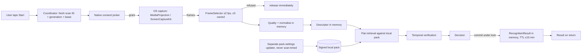

# THREAT_MODEL and data-flow map (P00-T06a/b, P06-T01 groundwork)

**Status: DRAFT by the implementing AI (Claude). Not reviewed by a privacy/security reviewer,
counsel or the owner.** It describes the code in this repository on 2026-10-09 and the
roadmap's intended mobile design. It approves nothing. G00 still needs a named reviewer.

## 1. Scope and assets

| Asset | Where it exists | Sensitivity |
|---|---|---|
| Captured frames (screen pixels) | Mobile: OS capture buffers, `ImageReader` / sample buffers, ≤3 app-owned decoded frames. Desktop L0: synthetic only | **Highest.** May contain other apps' content, notifications, keyboards, private views |
| Query descriptors (hash/thumbnail bytes) | Local variables during one scan | Screen-derived. Treated like pixels (F00) |
| Candidate lists, scores, offsets | Local variables during one scan | Screen-derived |
| RecognitionResult | Coordinator memory; expires ≤15 min | Screen-derived (says what the user watched). Memory only (D08 default) |
| Reference index pack + manifest | App files (mobile), `l0/packs/` (desktop, git-ignored) | Rights-bearing. Integrity-critical |
| Dev signing key | `l0/keys/*.dev.private.pem` (git-ignored) | Development only. Never a release key |
| Device rights state | Minimum rights epoch, installed byte totals | Integrity-critical, not personal |
| Terms receipt | Planned (P05-T02) | Personal-ish (acceptance time, locale) |

## 2. Data-flow (local Mode L; Mode R OFF)

There is **no** edge from any scan box to the network, to files, to logs or to telemetry.
The pack updater is a separate, user-initiated flow that is not built yet (P03-T06).

## 3. Threats (STRIDE-style) and current controls

| ID | Threat | Control in code now | Evidence | Residual / open |
|---|---|---|---|---|
| T-01 | Screen data leaves the device | Android LAB manifest removes INTERNET/ACCESS_NETWORK_STATE (also from merged deps). Desktop L0 has no network code. No analytics/crash SDK anywhere | Merged manifest / APK permission dump 2026-10-10: no INTERNET or network permission (TEST_EVIDENCE) | iOS has no manifest network switch; ATS is not a firewall (Q01). DATA-L00/L01 packet tests BLOCKED (B-01/B-02) |
| T-02 | Frames or descriptors persisted | No file writes in capture paths; results memory-only; `allowBackup=false`, data-extraction rules exclude everything | Code review; `test_result_records_have_no_pixel_or_descriptor_fields` | OS-owned diagnostics (tombstones, snapshots) are outside app control (CQ-12). DATA-L02 not run |
| T-03 | Capture continues after the user stops | Coordinator invalidates the generation on any observed stop, lock, revoke, cancel or deadline; lifecycle stops the projection once; frames refused after close | LIFE-01/02/03 Python harness; Kotlin coordinator + lifecycle JVM tests incl. 1,000 random orderings and injected-frame recognition races | Device latency of Stop (UX-02) unmeasured |
| T-04 | Stale or late result published after cancel | Commit rechecks generation, abort flag, lease, deadline and entitlement under one serialized path | Same tests | Process-level races on a real device untested |
| T-05 | OS stop misread as our own normal close | Our flag never establishes cause; adapter contract default "not attributable" → fail closed | `test_normal_close_flag_does_not_make_unattributable_stop_callback_safe`, Kotlin `asynchronousAckIsTrustedOnlyWithAttributableAdapter` | Real attribution semantics need LIFE-03 on devices |
| T-06 | Covert or automatic capture | Capture only after an explicit Start, the local eligibility gate, the disclosure and a fresh native consent per scan; a declined or empty picker result records PERMISSION_DENIED and never starts the mediaProjection service (ED-28); the service is not exported; late or unsolicited grants are stopped and released; the LAB build ships with capture disabled | Code review; `CaptureBoundaryTest` (Kotlin), `CaptureBoundaryTests` (Swift); `start` never resumes a previous acquisition | CONS-01/02/04/05 device runs BLOCKED; OS refusal of a consent-less mediaProjection FGS is a device check |
| T-07 | Tampered, stale or oversized pack | Ed25519 signature (V2: detached, over the exact bytes), payload hash, compatibility of format/preprocessing/calibration/descriptor/sampling, strict bounded parser, total installed budget, epoch and version-floor rollback refusal, validity window on parsed instants (future `valid_from` refused, `valid_until` exclusive), trusted time required for any expiring or licensed pack; crash-safe store | SEC-01 (`test_pack.py`, `test_pack_validity.py`, `test_store.py` with `os._exit` kills); 68 manifest and 49 format cases shared by Python, Kotlin and Swift | Release signing, key rotation, SEC-03 final tuple not built |
| T-08 | Rights bypass (unlicensed asset displayed or matched) | Default-deny grants; unaccepted D07 region methods refused; L0 grant excludes stills and training | `test_l0_grant_default_deny...`, region-method tests | L1 ledger and lease machinery BLOCKED (B-05) |
| T-09 | Wrong title shown as fact | VERIFIED blocked under competing works; episode/edition/time named only when unique; POSSIBLE visibly uncertain; no numeric confidence | LAB reports (synthetic) | Real-content precision unknown (B-06) |
| T-10 | Private views inside the chosen app | Not solved. Quality flags are not a privacy boundary | Synthetic private-screen fixtures never yield a title (LAB) | Consumer scope BLOCKED (D01 default, CAP-A03/CAP-04) |
| T-11 | Dev key used for release | Key ID prefix DEVKEY-; release mode rejects UNCALIBRATED packs | `test_release_mode_refuses_uncalibrated` | Release key ceremony not designed |
| T-12 | Secrets or private evidence in the public repo | `.gitignore` for keys, packs, media, tools, caches; staged-file scans before every push | Review log entries | Continuous discipline required |
| T-14 | Desktop LAB harness persists evidence | `l0/dac_l0/eval/run_lab.py` pickles hypotheses of **synthetic** queries to the git-ignored `l0/.cache/` to make calibration repeatable. It is harness-only and never compiled into a mobile build | Code review | Must not be ported to Kotlin/Swift. Loading a pickle trusts the local cache; acceptable only on the developer machine |
| T-15 | Malformed frame geometry (stride/size) causes out-of-bounds reads or crashes | `FrameView` bounds width/height, pixel and row stride before 64-bit size arithmetic and checks against the buffer limit; `RecognitionSession.process` returns INVALID for out-of-bounds input | `CaptureBoundaryTest` / `CaptureBoundaryTests` (negative, zero, overflowing and oversized strides; limit vs capacity) | Real `ImageReader`/`CVPixelBuffer` layouts are a device check |
| T-13 | Notification text leaks content | Notification shows only fixed text, never a title | Code review | Lock-screen visibility untested |

## 4. Out of scope until separately approved

Cloud Mode R, audio, camera mode, URL/download features, Snapchat, accounts, telemetry,
advertising (P11, deferred). Any of them would need a new threat model.
